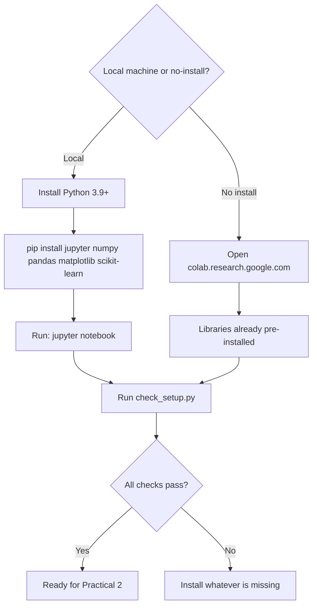

# 🛠️ Practical 1 — Setting Up Python, Jupyter, and Google Colab

   

> 🎯 Before any real machine learning happens, your environment needs to actually work. This practical gets you there, and gives you a real script to confirm it.

---

## 📋 Quick Facts

| | |
|---|---|
| 🎯 Course outcome | CO1 — foundational understanding, AI development lifecycle |
| 🛠️ Tools installed | Python 3.9+, Jupyter Notebook, `numpy`, `pandas`, `matplotlib`, `scikit-learn` |
| ⏱️ Time | 1-2 hours (mostly install time) |
| ✅ Tested | The verification script's output below is real |

---

## 📑 Contents

1. [What You'll Set Up](#1-what-youll-set-up)
2. [Visual Overview](#2-visual-overview)
3. [Two Real Ways to Work](#3-two-real-ways-to-work)
4. [Installing Python and Jupyter Locally](#4-installing-python-and-jupyter-locally)
5. [Using Google Colab Instead](#5-using-google-colab-instead)
6. [Verifying Your Real Setup](#6-verifying-your-real-setup)
7. [Full Code](#7-full-code)
8. [Try It Yourself](#8-try-it-yourself)
9. [Common Mistakes](#9-common-mistakes)
10. [Quiz](#10-quiz)
11. [Summary](#11-summary)

---

<a id="1-what-youll-set-up"></a>
## 1️⃣ What You'll Set Up

🎯 A real, working data science environment: Python itself, Jupyter Notebook (for running code interactively, cell by cell), and the 4 real libraries every later practical in this course depends on: `numpy`, `pandas`, `matplotlib`, `scikit-learn`.

| You will be able to... |
|---|
| ✅ Run Python code interactively in a real Jupyter Notebook |
| ✅ Use Google Colab as a real, no-install alternative |
| ✅ Verify every required real library is correctly installed |
| ✅ Know exactly what to fix if something is missing |

---

<a id="2-visual-overview"></a>
## 2️⃣ Visual Overview



---

<a id="3-two-real-ways-to-work"></a>
## 3️⃣ Two Real Ways to Work

| | Local (Jupyter) | Google Colab |
|---|---|---|
| **Install needed?** | Yes, once | No — runs in your browser |
| **Real libraries pre-installed?** | No, you install them | Yes, most are already there |
| **Works offline?** | Yes | No, needs internet |
| **Free real GPU access?** | No (unless you have one) | Yes, limited free real GPU/TPU |
| **Best for** | This course's local development | Quick starts, sharing, no-install access |

This course's practicals give you both: a local `.py` script AND a Colab cell version, in every single practical from here on.

---

<a id="4-installing-python-and-jupyter-locally"></a>
## 4️⃣ Installing Python and Jupyter Locally

```bash
# 1. Install Python 3.9 or newer from https://python.org (if not already installed)
python3 --version

# 2. Install the real libraries this course needs
pip install jupyter numpy pandas matplotlib scikit-learn

# 3. Launch Jupyter Notebook
jupyter notebook
```

This opens a real browser tab where you can create `.ipynb` notebooks and run Python code cell by cell.

---

<a id="5-using-google-colab-instead"></a>
## 5️⃣ Using Google Colab Instead

1. Go to [colab.research.google.com](https://colab.research.google.com)
2. Sign in with any real Google account
3. Click **New Notebook**
4. Type `import numpy, pandas, matplotlib, sklearn` in the first cell and run it (Shift+Enter) — if no error appears, you're ready

No installation needed — Colab's real servers already have these libraries.

---

<a id="6-verifying-your-real-setup"></a>
## 6️⃣ Verifying Your Real Setup

```python
import importlib
import sys

REQUIRED_PACKAGES = ["numpy", "pandas", "matplotlib", "sklearn", "jupyter"]

def check_package(name):
    try:
        module = importlib.import_module(name)
        version = getattr(module, "__version__", "unknown version")
        print(f"  {name}: installed ({version})")
        return True
    except ImportError:
        print(f"  {name}: NOT installed")
        return False
```

**What this does:** `importlib.import_module(name)` tries to actually load each real library. If it fails, that library genuinely isn't installed — this is more reliable than just checking a `requirements.txt` file, since it tests the real, current environment.

**Real output (from this environment):**
```
### CHECKING YOUR REAL PYTHON SETUP ###
Real Python version: 3.12.3
  OK (3.9+)

### CHECKING REQUIRED REAL LIBRARIES ###
  numpy: installed (2.4.4)
  pandas: installed (3.0.2)
  matplotlib: installed (3.10.8)
  sklearn: installed (1.8.0)
  jupyter: installed (unknown version)

### REAL RESULT ###
Everything is installed. You're ready to start Practical 2.
```

🔎 Your own real output will show whichever versions are installed on your machine — that's expected and fine, as long as every package shows "installed" and no "NOT installed" lines appear.

---

<a id="7-full-code"></a>
## 7️⃣ Full Code

```python
import importlib
import sys

REQUIRED_PACKAGES = ["numpy", "pandas", "matplotlib", "sklearn", "jupyter"]


def check_python_version():
    version = sys.version_info
    print(f"Real Python version: {version.major}.{version.minor}.{version.micro}")
    ok = version.major == 3 and version.minor >= 9
    print("  OK (3.9+)" if ok else "  WARNING: this course expects Python 3.9 or newer")
    return ok


def check_package(name):
    try:
        module = importlib.import_module(name)
        version = getattr(module, "__version__", "unknown version")
        print(f"  {name}: installed ({version})")
        return True
    except ImportError:
        print(f"  {name}: NOT installed")
        return False


if __name__ == "__main__":
    print("### CHECKING YOUR REAL PYTHON SETUP ###")
    python_ok = check_python_version()

    print("\n### CHECKING REQUIRED REAL LIBRARIES ###")
    results = {pkg: check_package(pkg) for pkg in REQUIRED_PACKAGES}

    all_ok = python_ok and all(results.values())
    print("\n### REAL RESULT ###")
    if all_ok:
        print("Everything is installed. You're ready to start Practical 2.")
    else:
        missing = [pkg for pkg, ok in results.items() if not ok]
        print(f"Missing packages: {missing}")
        print(f"Fix with: pip install {' '.join(missing)}")
```

---

<a id="8-try-it-yourself"></a>
## 8️⃣ Try It Yourself

1. 🔁 Run `check_setup.py` right now — does everything pass?
2. 🧪 Uninstall one package (`pip uninstall matplotlib`) and re-run — does the script correctly flag it as missing?
3. ☁️ Open Google Colab and run the same import check there — does it already pass with zero installs?
4. 📓 Create your first real Jupyter Notebook and run `print("Hello, AI")` in a cell.

---

<a id="9-common-mistakes"></a>
## ⚠️ Common Mistakes

| Mistake | Fix |
|---|---|
| Using `pip` when you meant `pip3` (or vice versa) | On some systems both exist separately — check `python3 -m pip install ...` if unsure |
| Installing packages in one Python environment but running Jupyter in another | Use `python3 -m pip install ...` from the same environment you'll launch Jupyter from |
| Assuming Colab has every possible library pre-installed | Most common ones are there, but some may need `!pip install` in a Colab cell |

---

<a id="10-quiz"></a>
## ❓ Quiz

1. What's the real difference between running Jupyter locally vs using Colab?
2. Why does `check_package()` use `importlib.import_module()` instead of just reading a requirements file?
3. Name the 4 real libraries every later practical in this course depends on.

<details>
<summary>Answers</summary>

1. Local Jupyter needs real installation and runs on your machine; Colab runs in the browser on Google's servers with most libraries already installed.
2. It tests whether the library can genuinely be loaded right now, in the real current environment — a requirements file only lists what should be installed, not what actually is.
3. `numpy`, `pandas`, `matplotlib`, `scikit-learn`.

</details>

---

<a id="11-summary"></a>
## 📝 Summary

| Check | Real result (this environment) |
|---|---|
| Python version | 3.12.3 — OK |
| numpy, pandas, matplotlib, sklearn, jupyter | All installed |

## 📂 Files

| File | What it is |
|---|---|
| `check_setup.py` | Full tested environment verification script |

➡️ **Next:** Practical 2 — Data Manipulation using NumPy and Pandas
