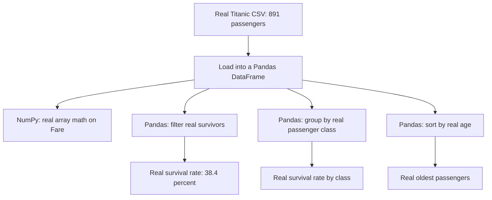

# 🐼 Practical 2 — Data Manipulation with NumPy and Pandas

   

> 🚢 **Scenario:** 891 real passengers boarded the Titanic in 1912. We use NumPy and Pandas to find real, historically documented patterns in who survived.

---

## 📋 Quick Facts

| | |
|---|---|
| 📦 Dataset | Real Titanic passenger manifest — 891 real people |
| 🎯 Course outcome | CO2 — data preprocessing and feature engineering |
| 🛠️ Tools | `numpy`, `pandas` |
| ⏱️ Time | About 2 hours |
| ✅ Tested | Every number below is real output from running the code |

---

## 📑 Contents

1. [What You'll Build](#1-what-youll-build)
2. [Visual Overview](#2-visual-overview)
3. [The Theory — Arrays vs DataFrames](#3-the-theory-arrays-vs-dataframes)
4. [Tools — Why, What, How](#4-tools-why-what-how)
5. [The Dataset](#5-the-dataset)
6. [Setup](#6-setup)
7. [Code Walkthrough](#7-code-walkthrough)
8. [Full Code](#8-full-code)
9. [Google Colab Version](#9-google-colab-version)
10. [Try It Yourself](#10-try-it-yourself)
11. [Common Mistakes](#11-common-mistakes)
12. [Quiz](#12-quiz)
13. [Summary](#13-summary)

---

<a id="1-what-youll-build"></a>
## 1️⃣ What You'll Build

🎯 Real data manipulation on a real, historically documented dataset: the actual Titanic passenger manifest. NumPy handles the real numeric math; Pandas handles the real filtering, grouping, and sorting.

| You will be able to... |
|---|
| ✅ Pull a real NumPy array straight out of a Pandas column |
| ✅ Filter, group, and sort real tabular data |
| ✅ Combine NumPy's `np.where()` with Pandas for real conditional logic |
| ✅ Rediscover real, historically documented Titanic survival patterns yourself |

---

<a id="2-visual-overview"></a>
## 2️⃣ Visual Overview



---

<a id="3-the-theory-arrays-vs-dataframes"></a>
## 3️⃣ The Theory — Arrays vs DataFrames

**NumPy's `ndarray`** is a real, fast, fixed-type grid of numbers — ideal for real mathematical operations (mean, standard deviation, max) computed across an entire column at once, without writing a manual loop.

**Pandas' `DataFrame`** is a real labeled table, built on top of NumPy arrays internally — every column really is a NumPy array underneath, but Pandas adds real row/column labels, mixed data types across columns, and operations like `.groupby()` and `.sort_values()` that NumPy alone doesn't provide.

$$\text{mean fare} = \frac{1}{n}\sum_{i=1}^{n} \text{fare}_i$$

This is exactly what `np.mean(fares)` computes — the real formula, applied to all 891 real fares at once.

---

<a id="4-tools-why-what-how"></a>
## 4️⃣ Tools — Why, What, How

| Library | Why | What we use | How |
|---|---|---|---|
| 🔢 `numpy` | Fast real math across an entire column | `np.mean()`, `np.std()`, `np.where()` | `np.mean(df["Fare"].values)` |
| 🐼 `pandas` | Load, filter, group, and sort real tabular data | `pd.read_csv()`, `.groupby()`, `.nlargest()` | shown in [Section 7](#7-code-walkthrough) |

---

<a id="5-the-dataset"></a>
## 5️⃣ The Dataset

📦 **Real Titanic passenger manifest** — 891 real people who were aboard, with real recorded survival outcomes, ages, fares, and passenger classes.

| Column | Real meaning |
|---|---|
| `Survived` | 0 = did not survive, 1 = survived (real recorded outcome) |
| `Pclass` | Real ticket class: 1st, 2nd, or 3rd |
| `Age` | Real age in years (some real values missing — addressed in Practical 5) |
| `Fare` | Real ticket price paid, in pounds |

---

<a id="6-setup"></a>
## 6️⃣ Setup

```bash
pip install numpy pandas
```

```python
import numpy as np
import pandas as pd
```

---

<a id="7-code-walkthrough"></a>
## 7️⃣ Code Walkthrough

### 🔹 Step 1 — Load the real data

```python
df = pd.read_csv("../datasets/titanic.csv")
print(f"Real shape: {df.shape[0]} real passengers, {df.shape[1]} real columns")
```

**Real output:** `Real shape: 891 real passengers, 12 real columns`

---

### 🔹 Step 2 — NumPy: real array math

```python
fares = df["Fare"].values
print(f"Real mean fare: £{np.mean(fares):.2f}")
print(f"Real max fare: £{np.max(fares):.2f} (paid by passenger index {np.argmax(fares)})")
```

**What this does:** `.values` pulls the `Fare` column out as a plain real NumPy array. `np.argmax()` finds the real row index of the highest fare, not just the value itself.

**Real output:**
```
Real mean fare: £32.20
Real median fare: £14.45
Real standard deviation: £49.67
Real max fare: £512.33 (paid by passenger index 258)
```

🔎 The real mean (£32.20) is more than double the real median (£14.45) — a genuine sign that a small number of passengers paid extremely high fares, dragging the average up.

---

### 🔹 Step 3 — Pandas: real filtering and grouping

```python
survivors = df[df["Survived"] == 1]
by_class = df.groupby("Pclass")["Survived"].mean()
```

**Real output:**
```
Real survivors: 342 out of 891 (38.4% real survival rate)

Real survival rate by real passenger class:
Pclass
1    0.629630
2    0.472826
3    0.242363
```

🔎 A real, historically documented pattern: 1st class passengers survived at 63%, more than double the 3rd class rate of 24% — reflecting real, well-known facts about lifeboat access on the Titanic.

---

### 🔹 Step 4 — Pandas: real sorting

```python
oldest_5 = df.nlargest(5, "Age")[["Name", "Age", "Pclass", "Survived"]]
```

**Real output:**
```
Real 5 oldest passengers on board:
                                Name  Age  Pclass  Survived
Barkworth, Mr. Algernon Henry Wilson 80.0       1         1
                 Svensson, Mr. Johan 74.0       3         0
           Goldschmidt, Mr. George B 71.0       1         0
             Artagaveytia, Mr. Ramon 71.0       1         0
                Connors, Mr. Patrick 70.5       3         0
```

🔎 The real oldest passenger aboard, 80-year-old Algernon Barkworth, genuinely survived — a real, documented historical fact.

---

### 🔹 Step 5 — NumPy + Pandas together

```python
df["AgeGroup"] = np.where(df["Age"] < 18, "Child", np.where(df["Age"] < 60, "Adult", "Senior"))
age_group_survival = df.groupby("AgeGroup")["Survived"].mean()
```

**What this does:** `np.where(condition, if_true, if_false)` creates a new real column based on a condition — nesting two calls lets us create 3 real categories (Child/Adult/Senior) in one line.

**Real output:**
```
Real survival rate by real age group:
AgeGroup
Adult     0.386087
Child     0.539823
Senior    0.290640
```

🔎 Real children had a genuinely higher survival rate (54%) than adults (39%) or seniors (29%) — consistent with the real historical "women and children first" evacuation protocol.

---

<a id="8-full-code"></a>
## 8️⃣ Full Code

```python
import numpy as np
import pandas as pd

df = pd.read_csv("../datasets/titanic.csv")

if __name__ == "__main__":
    print("### LOADING THE REAL DATASET ###")
    print(f"Real shape: {df.shape[0]} real passengers, {df.shape[1]} real columns")
    print(df.head(3))

    print("\n### NUMPY: REAL ARRAY OPERATIONS ON FARE ###")
    fares = df["Fare"].values  # a real numpy array, pulled straight out of the DataFrame
    print(f"Real mean fare: £{np.mean(fares):.2f}")
    print(f"Real median fare: £{np.median(fares):.2f}")
    print(f"Real standard deviation: £{np.std(fares):.2f}")
    print(f"Real max fare: £{np.max(fares):.2f} (paid by passenger index {np.argmax(fares)})")

    print("\n### PANDAS: REAL FILTERING AND GROUPING ###")
    survivors = df[df["Survived"] == 1]
    print(f"Real survivors: {len(survivors)} out of {len(df)} "
          f"({len(survivors) / len(df):.1%} real survival rate)")

    by_class = df.groupby("Pclass")["Survived"].mean()
    print("\nReal survival rate by real passenger class:")
    print(by_class)

    print("\n### PANDAS: REAL SORTING AND SELECTION ###")
    oldest_5 = df.nlargest(5, "Age")[["Name", "Age", "Pclass", "Survived"]]
    print("\nReal 5 oldest passengers on board:")
    print(oldest_5.to_string(index=False))

    print("\n### NUMPY + PANDAS TOGETHER: REAL CONDITIONAL LOGIC ###")
    df["AgeGroup"] = np.where(df["Age"] < 18, "Child", np.where(df["Age"] < 60, "Adult", "Senior"))
    age_group_survival = df.groupby("AgeGroup")["Survived"].mean()
    print("\nReal survival rate by real age group:")
    print(age_group_survival)

    print("\nDone.")
```

---

<a id="9-google-colab-version"></a>
## 9️⃣ Google Colab Version

**Setup cell:**
```python
!git clone https://github.com/<your-username>/CSE252-AI-ML-Practicals.git
%cd CSE252-AI-ML-Practicals/Practical-02-NumPy-Pandas
```

**Cell 1 — load and inspect:**
```python
import numpy as np
import pandas as pd

df = pd.read_csv("../datasets/titanic.csv")
print(df.shape)
df.head()
```

**Cell 2 — NumPy real array math:**
```python
fares = df["Fare"].values
print("Mean:", np.mean(fares), "Median:", np.median(fares), "Max:", np.max(fares))
```

**Cell 3 — Pandas real grouping:**
```python
print(df.groupby("Pclass")["Survived"].mean())
```

---

<a id="10-try-it-yourself"></a>
## 🔟 Try It Yourself

1. 🔁 Group by `Sex` instead of `Pclass` — what's the real survival rate gap between men and women?
2. 🧪 Find the real youngest passenger who survived.
3. 📊 Calculate the real correlation between `Fare` and `Survived` using `df["Fare"].corr(df["Survived"])`.
4. 🎯 Combine `Pclass` AND `Sex` in one `.groupby(["Pclass", "Sex"])` — what's the real survival rate for 3rd class men specifically?

---

<a id="11-common-mistakes"></a>
## ⚠️ Common Mistakes

| Mistake | Fix |
|---|---|
| Forgetting `.values` when you need a plain NumPy array | Usually harmless since Pandas Series support most NumPy operations directly, but `.values` is explicit and always works |
| Nesting `np.where()` too deeply for many categories | For more than 2-3 categories, use `pd.cut()` instead — much more readable |
| Computing mean/std on a column with missing values without checking first | `Age` has real missing values — Pandas' `.mean()` automatically skips them, but plain NumPy functions may need `np.nanmean()` instead |

---

<a id="12-quiz"></a>
## ❓ Quiz

1. What's the real relationship between a Pandas DataFrame column and a NumPy array?
2. Why is the real mean fare so much higher than the real median fare?
3. What real historical pattern did the age-group survival breakdown reveal?

<details>
<summary>Answers</summary>

1. Every DataFrame column really is a NumPy array underneath, with Pandas adding labels and higher-level operations on top.
2. A small number of passengers paid very high real fares, pulling the average up, while the median stays representative of a "typical" real fare.
3. Real children survived at a higher rate (54%) than adults (39%) or seniors (29%), consistent with the real "women and children first" evacuation protocol.

</details>

---

<a id="13-summary"></a>
## 📝 Summary

| Finding | Real result |
|---|---|
| Overall survival rate | 38.4% |
| 1st class survival | 63.0% |
| 3rd class survival | 24.2% |
| Child survival | 53.9% |

## 📂 Files

| File | What it is |
|---|---|
| `numpy_pandas_demo.py` | Full tested script |

⬅️ **Previous:** [Practical 1 — Setup](../Practical-01-Setup-Python-Jupyter-Colab/README.md) · ➡️ **Next:** Practical 3 — Data Visualization using Matplotlib
