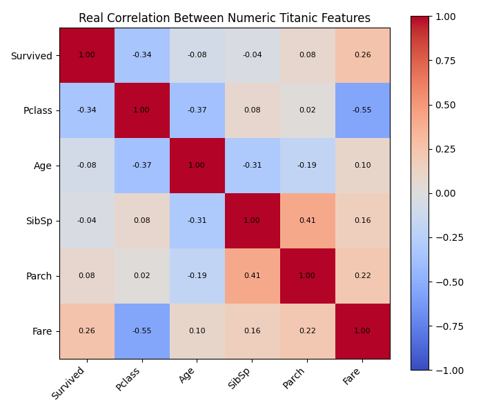
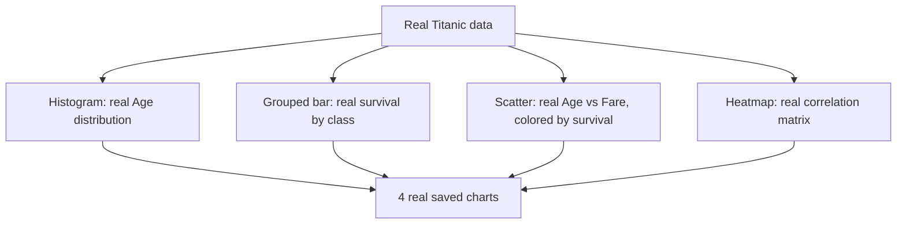
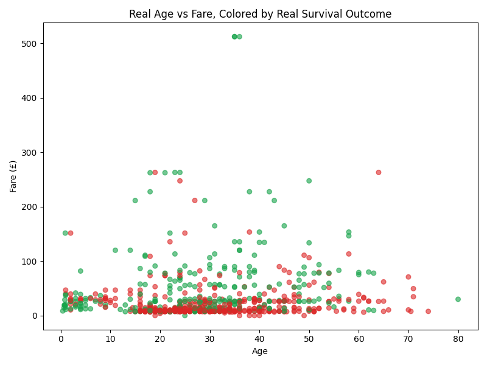

# 📊 Practical 3 — Data Visualization with Matplotlib

   

> 📈 **Why visualize first?** Before building any model, you should be able to see the real patterns in your data. This practical builds 4 real charts from the real Titanic dataset.

<p align="center"></p>

---

## 📋 Quick Facts

| | |
|---|---|
| 📦 Dataset | Real Titanic passenger manifest — 891 real people |
| 🎯 Course outcome | CO2 — data visualization for AI model development |
| 🛠️ Tools | `matplotlib`, `pandas` |
| ⏱️ Time | About 2 hours |
| ✅ Tested | Every chart and number below is real output from running the code |

---

## 📑 Contents

1. [What You'll Build](#1-what-youll-build)
2. [Visual Overview](#2-visual-overview)
3. [The Theory — Choosing the Right Chart](#3-the-theory-choosing-the-right-chart)
4. [Tools — Why, What, How](#4-tools-why-what-how)
5. [The Dataset](#5-the-dataset)
6. [Setup](#6-setup)
7. [Code Walkthrough](#7-code-walkthrough)
8. [Full Code](#8-full-code)
9. [Google Colab Version](#9-google-colab-version)
10. [Try It Yourself](#10-try-it-yourself)
11. [Common Mistakes](#11-common-mistakes)
12. [Quiz](#12-quiz)
13. [Summary](#13-summary)

---

<a id="1-what-youll-build"></a>
## 1️⃣ What You'll Build

🎯 Four real, distinct chart types on the real Titanic data, each answering a different real question: a histogram (what does one variable look like?), a grouped bar chart (how do categories compare?), a scatter plot (how do two variables relate, split by a third?), and a correlation heatmap (how does everything relate to everything else?).

| You will be able to... |
|---|
| ✅ Build a real histogram, bar chart, scatter plot, and heatmap |
| ✅ Color-code a scatter plot by a real categorical outcome |
| ✅ Read a real correlation matrix and find the strongest real relationship |
| ✅ Save charts to real files instead of just displaying them |

---

<a id="2-visual-overview"></a>
## 2️⃣ Visual Overview



---

<a id="3-the-theory-choosing-the-right-chart"></a>
## 3️⃣ The Theory — Choosing the Right Chart

| Question you're asking | Real chart to use |
|---|---|
| What does one variable's spread look like? | Histogram |
| How do counts compare across categories? | Bar chart |
| How do two numeric variables relate? | Scatter plot |
| How does every variable relate to every other? | Correlation heatmap |

**Correlation** measures how strongly two variables move together, from $-1$ (perfectly opposite) to $+1$ (perfectly together):

$$r = \frac{\sum (x_i - \bar{x})(y_i - \bar{y})}{\sqrt{\sum (x_i - \bar{x})^2 \sum (y_i - \bar{y})^2}}$$

Pandas' `.corr()` computes this real formula for every pair of columns at once.

---

<a id="4-tools-why-what-how"></a>
## 4️⃣ Tools — Why, What, How

| Library | Why | What we use | How |
|---|---|---|---|
| 📊 `matplotlib` | Draw and save every real chart | `plt.hist()`, `plt.scatter()`, `plt.imshow()` | shown in [Section 7](#7-code-walkthrough) |
| 🐼 `pandas` | Load data and compute the real correlation matrix | `pd.read_csv()`, `.corr()`, `.groupby()` | `df[numeric_cols].corr()` |

---

<a id="5-the-dataset"></a>
## 5️⃣ The Dataset

📦 Same real Titanic manifest as Practical 2 — 891 real passengers.

---

<a id="6-setup"></a>
## 6️⃣ Setup

```bash
pip install matplotlib pandas
```

```python
import os
import matplotlib.pyplot as plt
import pandas as pd
```

---

<a id="7-code-walkthrough"></a>
## 7️⃣ Code Walkthrough

### 🔹 Chart 1 — Real age distribution

```python
plt.hist(df["Age"].dropna(), bins=30, color="#2563eb", edgecolor="white")
```

**What this does:** `.dropna()` removes real missing ages first — `plt.hist()` can't handle `NaN` values. 30 bins gives a real, detailed view of the age spread.

---

### 🔹 Chart 2 — Real survival counts by class

```python
survival_by_class = df.groupby(["Pclass", "Survived"]).size().unstack()
survival_by_class.plot(kind="bar", color=["#dc2626", "#16a34a"])
```

**What this does:** `.groupby(["Pclass", "Survived"]).size()` counts real passengers in every class/outcome combination; `.unstack()` reshapes this into a real table Matplotlib can plot as grouped bars.

---

### 🔹 Chart 3 — Real Age vs Fare scatter, colored by survival

```python
colors = df["Survived"].map({0: "#dc2626", 1: "#16a34a"})
plt.scatter(df["Age"], df["Fare"], c=colors, alpha=0.6, s=30)
```

**What this does:** `.map()` converts the real 0/1 survival column into real color codes, so red dots are real non-survivors and green dots are real survivors, visible directly in the scatter plot.



---

### 🔹 Chart 4 — Real correlation heatmap

```python
numeric_cols = ["Survived", "Pclass", "Age", "SibSp", "Parch", "Fare"]
corr = df[numeric_cols].corr()
im = ax.imshow(corr, cmap="coolwarm", vmin=-1, vmax=1)
```

**What this does:** computes the real correlation between every pair of numeric columns, then `imshow()` colors each cell — deep red for strong positive correlation, deep blue for strong negative.

**Real output:**
```
Real strongest correlate of survival: Pclass (correlation = -0.34)
```


🔎 The real negative correlation between `Pclass` and `Survived` (-0.34) confirms numerically what Practical 2 found by grouping: lower-numbered (better) classes had real higher survival — `Pclass` 1 is "better" than 3, so the negative sign means better class genuinely associates with survival.

---

<a id="8-full-code"></a>
## 8️⃣ Full Code

```python
import os

import matplotlib.pyplot as plt
import pandas as pd

df = pd.read_csv("../datasets/titanic.csv")
os.makedirs("images", exist_ok=True)

if __name__ == "__main__":
    print(f"Real dataset: {len(df)} real passengers")

    # Chart 1: real age distribution
    plt.figure(figsize=(8, 5))
    plt.hist(df["Age"].dropna(), bins=30, color="#2563eb", edgecolor="white")
    plt.xlabel("Age")
    plt.ylabel("Number of real passengers")
    plt.title("Real Age Distribution of Titanic Passengers")
    plt.tight_layout()
    plt.savefig("images/01_age_distribution.png")
    plt.close()
    print("Saved: real age distribution histogram")

    # Chart 2: real survival counts by class
    survival_by_class = df.groupby(["Pclass", "Survived"]).size().unstack()
    survival_by_class.plot(kind="bar", figsize=(8, 5), color=["#dc2626", "#16a34a"])
    plt.xlabel("Passenger Class")
    plt.ylabel("Number of real passengers")
    plt.title("Real Survival Counts by Passenger Class")
    plt.legend(["Did not survive", "Survived"])
    plt.xticks(rotation=0)
    plt.tight_layout()
    plt.savefig("images/02_survival_by_class.png")
    plt.close()
    print("Saved: real survival by class bar chart")

    # Chart 3: real fare vs age scatter, colored by survival
    plt.figure(figsize=(8, 6))
    colors = df["Survived"].map({0: "#dc2626", 1: "#16a34a"})
    plt.scatter(df["Age"], df["Fare"], c=colors, alpha=0.6, s=30)
    plt.xlabel("Age")
    plt.ylabel("Fare (£)")
    plt.title("Real Age vs Fare, Colored by Real Survival Outcome")
    plt.tight_layout()
    plt.savefig("images/03_age_vs_fare.png")
    plt.close()
    print("Saved: real age vs fare scatter plot")

    # Chart 4: real correlation heatmap-style summary
    numeric_cols = ["Survived", "Pclass", "Age", "SibSp", "Parch", "Fare"]
    corr = df[numeric_cols].corr()
    fig, ax = plt.subplots(figsize=(7, 6))
    im = ax.imshow(corr, cmap="coolwarm", vmin=-1, vmax=1)
    ax.set_xticks(range(len(numeric_cols)))
    ax.set_yticks(range(len(numeric_cols)))
    ax.set_xticklabels(numeric_cols, rotation=45, ha="right")
    ax.set_yticklabels(numeric_cols)
    for i in range(len(numeric_cols)):
        for j in range(len(numeric_cols)):
            ax.text(j, i, f"{corr.iloc[i, j]:.2f}", ha="center", va="center", fontsize=8)
    plt.colorbar(im)
    plt.title("Real Correlation Between Numeric Titanic Features")
    plt.tight_layout()
    plt.savefig("images/04_correlation_heatmap.png")
    plt.close()
    print("Saved: real correlation heatmap")

    strongest = corr["Survived"].drop("Survived").abs().idxmax()
    print(f"\nReal strongest correlate of survival: {strongest} "
          f"(correlation = {corr['Survived'][strongest]:.2f})")

    print("\nDone. 4 real charts saved in images/")
```

---

<a id="9-google-colab-version"></a>
## 9️⃣ Google Colab Version

**Setup cell:**
```python
!git clone https://github.com/<your-username>/CSE252-AI-ML-Practicals.git
%cd CSE252-AI-ML-Practicals/Practical-03-Matplotlib-Visualization
```

**Cell 1 — histogram and bar chart:**
```python
import matplotlib.pyplot as plt
import pandas as pd

df = pd.read_csv("../datasets/titanic.csv")
plt.hist(df["Age"].dropna(), bins=30)
plt.title("Age Distribution")
plt.show()

df.groupby(["Pclass", "Survived"]).size().unstack().plot(kind="bar")
plt.show()
```

**Cell 2 — scatter and heatmap:**
```python
colors = df["Survived"].map({0: "red", 1: "green"})
plt.scatter(df["Age"], df["Fare"], c=colors, alpha=0.6)
plt.show()

corr = df[["Survived", "Pclass", "Age", "SibSp", "Parch", "Fare"]].corr()
plt.imshow(corr, cmap="coolwarm", vmin=-1, vmax=1)
plt.colorbar()
plt.show()
```

---

<a id="10-try-it-yourself"></a>
## 🔟 Try It Yourself

1. 🔁 Add a 5th chart: a boxplot of `Fare` grouped by `Pclass` using `df.boxplot(column="Fare", by="Pclass")`.
2. 🧪 Change the histogram to show separate real distributions for survivors vs non-survivors (overlaid).
3. 📊 Try `plt.pie()` for the real gender breakdown of passengers.
4. 🎨 Change the heatmap's `cmap` to `"viridis"` — how does the interpretation change?

---

<a id="11-common-mistakes"></a>
## ⚠️ Common Mistakes

| Mistake | Fix |
|---|---|
| Forgetting `.dropna()` before `plt.hist()` on a column with missing values | Matplotlib may error or silently skip real data |
| Not calling `plt.close()` after `savefig()` in a loop | Figures accumulate in memory across many charts |
| Only including numeric columns you assume matter for `.corr()` | Always explicitly list columns — including a non-numeric column raises an error |

---

<a id="12-quiz"></a>
## ❓ Quiz

1. Why must you use `.dropna()` before plotting `Age` as a histogram?
2. What does a correlation of `-0.34` between `Pclass` and `Survived` actually mean?
3. Which real chart type would you use to compare survival counts across 3 categories?

<details>
<summary>Answers</summary>

1. `Age` has real missing values, and `plt.hist()` cannot plot `NaN` values directly.
2. As `Pclass` number increases (worse class), `Survived` tends to decrease — a real, moderate negative relationship.
3. A grouped bar chart.

</details>

---

<a id="13-summary"></a>
## 📝 Summary

| Chart | Real key finding |
|---|---|
| Age histogram | Most passengers were real young adults (20s-30s) |
| Survival by class | 1st class had far more real survivors than 3rd |
| Age vs Fare scatter | Higher real fares cluster more with survival (green) |
| Correlation heatmap | `Pclass` is the strongest real correlate of survival (-0.34) |

## 📂 Files

| File | What it is |
|---|---|
| `matplotlib_demo.py` | Full tested script |
| `images/01-04*.png` | 4 real generated charts |

⬅️ **Previous:** [Practical 2 — NumPy and Pandas](../Practical-02-NumPy-Pandas/README.md) · ➡️ **Next:** Practical 4 — Exploratory Data Analysis
