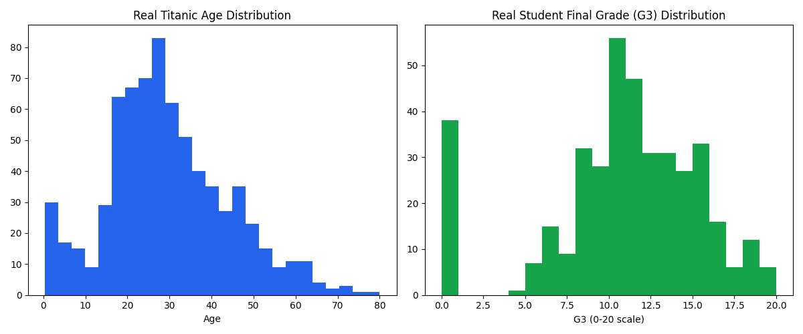
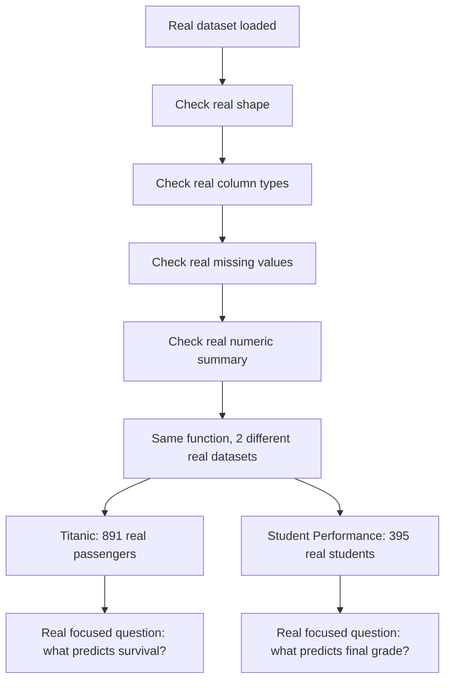
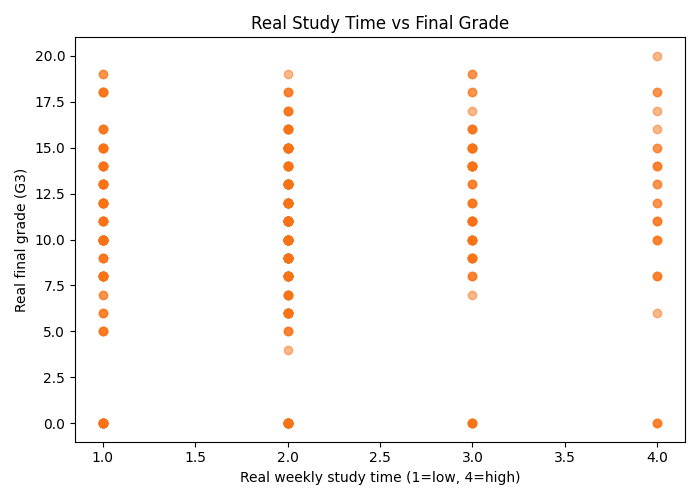

# 🔍 Practical 4 — Exploratory Data Analysis on Two Real Datasets

   

> 🔎 **The rule every data scientist follows:** never build a model on data you haven't actually looked at first. This practical runs a real, systematic first look at two completely different real datasets.

<p align="center"></p>

---

## 📋 Quick Facts

| | |
|---|---|
| 📦 Datasets | Real Titanic manifest (891 passengers) + real UCI Student Performance (395 students) |
| 🎯 Course outcome | CO2 — exploratory data analysis on real-world datasets |
| 🛠️ Tools | `pandas`, `matplotlib` |
| ⏱️ Time | About 2 hours |
| ✅ Tested | Every number and chart below is real output from running the code |

---

## 📑 Contents

1. [What You'll Build](#1-what-youll-build)
2. [Visual Overview](#2-visual-overview)
3. [The Theory — What EDA Actually Checks](#3-the-theory-what-eda-actually-checks)
4. [Tools — Why, What, How](#4-tools-why-what-how)
5. [The Datasets](#5-the-datasets)
6. [Setup](#6-setup)
7. [Code Walkthrough](#7-code-walkthrough)
8. [Full Code](#8-full-code)
9. [Google Colab Version](#9-google-colab-version)
10. [Try It Yourself](#10-try-it-yourself)
11. [Common Mistakes](#11-common-mistakes)
12. [Quiz](#12-quiz)
13. [Summary](#13-summary)

---

<a id="1-what-youll-build"></a>
## 1️⃣ What You'll Build

🎯 A real, reusable EDA function applied to two genuinely different real datasets — proving the same systematic checklist works regardless of domain: shape, column types, missing values, and numeric summary statistics.

| You will be able to... |
|---|
| ✅ Write one reusable real EDA function that works on any dataset |
| ✅ Spot real missing data before it causes silent bugs later |
| ✅ Find the real strongest correlates of a target variable |
| ✅ Compare two structurally different real datasets side by side |

---

<a id="2-visual-overview"></a>
## 2️⃣ Visual Overview



---

<a id="3-the-theory-what-eda-actually-checks"></a>
## 3️⃣ The Theory — What EDA Actually Checks

Every real EDA pass answers the same 4 real questions, regardless of the dataset's subject:

| Question | Why it matters |
|---|---|
| What's the real shape? | Tells you how much real data you have to work with |
| What are the real column types? | Numeric columns need different handling than real categorical/text columns |
| What's missing? | Missing real data can silently break later calculations or bias a model |
| What do the real numbers look like? | Mean, min, max, and quartiles reveal real outliers and scale differences |

---

<a id="4-tools-why-what-how"></a>
## 4️⃣ Tools — Why, What, How

| Library | Why | What we use | How |
|---|---|---|---|
| 🐼 `pandas` | Every real EDA check is a Pandas one-liner | `.shape`, `.dtypes`, `.isnull()`, `.describe()` | shown in [Section 7](#7-code-walkthrough) |
| 📊 `matplotlib` | Visualize real distributions side by side | `plt.subplots()`, `plt.scatter()` | shown in [Section 7](#7-code-walkthrough) |

---

<a id="5-the-datasets"></a>
## 5️⃣ The Datasets

📦 **Titanic** — 891 real passengers (reused from Practicals 2-3).

📦 **Student Performance** — 395 real Portuguese secondary school students, real UCI dataset (Cortez & Silva, 2008). Real features include study time, past failures, parental education, and 3 real grade checkpoints (`G1`, `G2`, `G3` — first period, second period, and final grade, each on a real 0-20 scale).

---

<a id="6-setup"></a>
## 6️⃣ Setup

```bash
pip install pandas matplotlib
```

```python
import pandas as pd
import matplotlib.pyplot as plt
import seaborn as sns

from sklearn.preprocessing import StandardScaler
```

---

<a id="7-code-walkthrough"></a>
## 7️⃣ Code Walkthrough

### 🔹 Step 1 — One reusable real EDA function

```python
print(titanic_data.head())
print(titanic_data.shape)
print(titanic_data.dtypes)
print(titanic_data.isnull().sum())
print(titanic_data.describe())
```

**What this does:** this single function runs identically on any real DataFrame — we call it twice, once per dataset, proving the same real EDA checklist generalizes.

**Real output (Titanic):**
```
Real shape: 891 rows, 12 columns
Real missing values:
Age         177
Cabin       687
Embarked      2
```

**Real output (Student Performance):**
```
Real shape: 395 rows, 33 columns
No real missing values.
```

🔎 A genuinely useful real contrast: Titanic has real missing data that must be handled (Practical 5 does exactly this), while the Student Performance dataset is real and complete — not every real dataset needs the same preprocessing.

---

### 🔹 Step 2 — A real focused question: what predicts the final grade?

```python
numeric_student = student_data.select_dtypes(include="number")
corr_with_g3 = numeric_student.corr()["G3"].drop("G3")
corr_with_g3 = corr_with_g3.sort_values(key=abs, ascending=False)
print(corr_with_g3.head(5))
```

**Real output:**
```
Real top 5 correlates of final grade (G3):
G2          0.904868
G1          0.801468
failures   -0.360415
Medu        0.217147
age        -0.161579
```

🔎 A genuinely expected but reassuring real result: earlier real grades (`G1`, `G2`) are by far the strongest real predictors of the final grade — makes intuitive sense, and confirms the data behaves sensibly. Real past `failures` negatively correlates, as expected.

---

### 🔹 Step 3 — Real side-by-side visual comparison

```python
plt.hist(titanic_data["Age"].dropna(), bins=20)
plt.hist(student_data["G3"], bins=20)
plt.show()
```


🔎 Notice the real spike at `G3 = 0` in the student grade distribution — this represents real students who dropped out or didn't sit the final exam, a genuine real-world data quirk EDA catches before it silently skews a later model.



---

<a id="8-full-code"></a>
## 8️⃣ Full Code

```python
import pandas as pd
import matplotlib.pyplot as plt
import seaborn as sns

from sklearn.preprocessing import StandardScaler


# ==================================================
# TITANIC DATASET
# ==================================================

print("\nTITANIC DATASET")
print("=" * 40)

# Load dataset
titanic_data = pd.read_csv("../datasets/titanic.csv")

# Use Gender name for the categorical column
titanic_data = titanic_data.rename(
    columns={"Sex": "Gender"}
)

# EDA
print("\nFirst 5 rows")
print(titanic_data.head())

print("\nShape")
print(titanic_data.shape)

print("\nData Types")
print(titanic_data.dtypes)

print("\nMissing Values")
print(titanic_data.isnull().sum())

print("\nSummary Statistics")
print(titanic_data.describe())

print("\nGender Count")
print(titanic_data["Gender"].value_counts())

print("\nSurvival Count")
print(titanic_data["Survived"].value_counts())

# Handle missing values
titanic_data["Age"] = titanic_data["Age"].fillna(
    titanic_data["Age"].median()
)

titanic_data["Embarked"] = titanic_data["Embarked"].fillna(
    titanic_data["Embarked"].mode()[0]
)

# Keep useful columns for analysis
titanic_data = titanic_data[
    [
        "Survived", "Pclass", "Gender", "Age",
        "SibSp", "Parch", "Fare", "Embarked"
    ]
]

# Encoding
titanic_data = pd.get_dummies(
    titanic_data,
    columns=["Gender", "Embarked"],
    drop_first=True,
    dtype=int
)

# Feature scaling
scaler = StandardScaler()
titanic_data["Age"] = scaler.fit_transform(
    titanic_data[["Age"]]
)

titanic_data["Fare"] = scaler.fit_transform(
    titanic_data[["Fare"]]
)

print("\nProcessed Titanic Data")
print(titanic_data.head())

# EDA visualizations
sns.countplot(x="Survived", data=titanic_data)
plt.title("Titanic Survival Count")
plt.show()

sns.histplot(titanic_data["Age"], bins=20)
plt.title("Titanic Age Distribution")
plt.show()

sns.heatmap(
    titanic_data.corr(),
    annot=True,
    fmt=".2f"
)
plt.title("Titanic Correlation")
plt.show()


# ==================================================
# STUDENT PERFORMANCE DATASET
# ==================================================

print("\nSTUDENT PERFORMANCE DATASET")
print("=" * 40)

# Load dataset
student_data = pd.read_csv(
    "../datasets/student-mat.csv"
)

# Use Gender name for the categorical column
student_data = student_data.rename(
    columns={"sex": "Gender"}
)

# EDA
print("\nFirst 5 rows")
print(student_data.head())

print("\nShape")
print(student_data.shape)

print("\nData Types")
print(student_data.dtypes)

print("\nMissing Values")
print(student_data.isnull().sum())

print("\nSummary Statistics")
print(student_data.describe())

print("\nGender Count")
print(student_data["Gender"].value_counts())

print("\nFinal Grade Summary")
print(student_data["G3"].describe())

# Encoding categorical columns
student_data = pd.get_dummies(
    student_data,
    drop_first=True,
    dtype=int
)

# Feature scaling
scaler = StandardScaler()
student_data[
    [
        "age", "Medu", "Fedu", "traveltime",
        "studytime", "failures", "absences",
        "G1", "G2", "G3"
    ]
] = scaler.fit_transform(
    student_data[
        [
            "age", "Medu", "Fedu", "traveltime",
            "studytime", "failures", "absences",
            "G1", "G2", "G3"
        ]
    ]
)

print("\nProcessed Student Data")
print(student_data.head())

# EDA visualizations
sns.histplot(student_data["G3"], bins=20)
plt.title("Student Final Grade Distribution")
plt.show()

# Correlation with final grade
student_correlation = student_data.corr()["G3"]
student_correlation = student_correlation.drop("G3")
student_correlation = student_correlation.sort_values(
    key=abs,
    ascending=False
)

print("\nTop 5 Correlations with G3")
print(student_correlation.head(5))

# Correlation heatmap
sns.heatmap(
    student_data.corr(),
    annot=False
)
plt.title("Student Performance Correlation")
plt.show()

print("\nEDA and Preprocessing Completed")
```

---

<a id="9-google-colab-version"></a>
## 9️⃣ Google Colab Version

**Setup cell:**
```python
!pip install pandas matplotlib seaborn scikit-learn
```

### Cell 1 — Titanic Dataset

```python
import pandas as pd
import matplotlib.pyplot as plt
import seaborn as sns

from sklearn.preprocessing import StandardScaler

titanic_data = pd.read_csv(
    "../datasets/titanic.csv"
)

titanic_data = titanic_data.rename(
    columns={"Sex": "Gender"}
)

print(titanic_data.head())
print(titanic_data.shape)
print(titanic_data.dtypes)
print(titanic_data.isnull().sum())
print(titanic_data.describe())

titanic_data["Age"] = titanic_data["Age"].fillna(
    titanic_data["Age"].median()
)

titanic_data["Embarked"] = titanic_data["Embarked"].fillna(
    titanic_data["Embarked"].mode()[0]
)

titanic_data = titanic_data[
    [
        "Survived", "Pclass", "Gender", "Age",
        "SibSp", "Parch", "Fare", "Embarked"
    ]
]

titanic_data = pd.get_dummies(
    titanic_data,
    columns=["Gender", "Embarked"],
    drop_first=True,
    dtype=int
)

scaler = StandardScaler()
titanic_data[["Age", "Fare"]] = scaler.fit_transform(
    titanic_data[["Age", "Fare"]]
)

print(titanic_data.head())

sns.countplot(x="Survived", data=titanic_data)
plt.show()

sns.heatmap(titanic_data.corr(), annot=True, fmt=".2f")
plt.show()
```

### Cell 2 — Student Performance Dataset

```python
student_data = pd.read_csv(
    "../datasets/student-mat.csv"
)

student_data = student_data.rename(
    columns={"sex": "Gender"}
)

print(student_data.head())
print(student_data.shape)
print(student_data.dtypes)
print(student_data.isnull().sum())
print(student_data.describe())

student_data = pd.get_dummies(
    student_data,
    drop_first=True,
    dtype=int
)

scaler = StandardScaler()
student_scores = [
    "age", "Medu", "Fedu", "traveltime",
    "studytime", "failures", "absences",
    "G1", "G2", "G3"
]

student_data[student_scores] = scaler.fit_transform(
    student_data[student_scores]
)

print(student_data.head())

plt.hist(student_data["G3"], bins=20)
plt.xlabel("G3")
plt.ylabel("Count")
plt.title("Final Grade Distribution")
plt.show()

print(student_data.corr()["G3"].sort_values(
    key=abs, ascending=False
).head(5))
```

---

<a id="10-try-it-yourself"></a>
## 🔟 Try It Yourself

1. 🔁 Run `eda_report()` on just the `student-mat.csv` numeric columns grouped by `sex` — any real differences?
2. 🧪 Find which real Titanic column has the most missing values, and by what percentage.
3. 📊 Plot `failures` vs `G3` as a boxplot — does more real past failure predict a lower final grade?
4. 🎯 Add a 3rd real dataset of your choice and confirm `eda_report()` works on it unmodified.

---

<a id="11-common-mistakes"></a>
## ⚠️ Common Mistakes

| Mistake | Fix |
|---|---|
| Skipping EDA and jumping straight to modeling | Real missing values or real outliers can silently break or bias a model |
| Assuming `.describe()` covers non-numeric columns | It only summarizes real numeric columns by default |
| Ignoring a real spike at 0 in a grade/score distribution | Often signals real dropouts or non-participants, not genuine zero scores |

---

<a id="12-quiz"></a>
## ❓ Quiz

1. What are the 4 real questions every EDA pass should answer?
2. Why does the Student Performance dataset need no missing-value handling, unlike Titanic?
3. What did the real correlation analysis reveal about predicting G3?

<details>
<summary>Answers</summary>

1. Real shape, real column types, real missing values, real numeric summary.
2. It's a genuinely complete real dataset — every real student's every attribute was recorded, unlike Titanic's historical records.
3. Earlier real grades (G1, G2) are by far the strongest predictors — unsurprising, but a valuable real sanity check.

</details>

---

<a id="13-summary"></a>
## 📝 Summary

| Dataset | Real missing data | Real key insight |
|---|---|---|
| Titanic | Age (177), Cabin (687), Embarked (2) | Real missing data must be handled before modeling |
| Student Performance | None | G1/G2 grades are the strongest real predictors of G3 |

## 📂 Files

| File | What it is |
|---|---|
| `eda_demo.py` | Full tested script |
| `images/01-02*.png` | 2 real generated charts |

⬅️ **Previous:** [Practical 3 — Matplotlib](../Practical-03-Matplotlib-Visualization/README.md) · ➡️ **Next:** Practical 5 — Data Preprocessing
