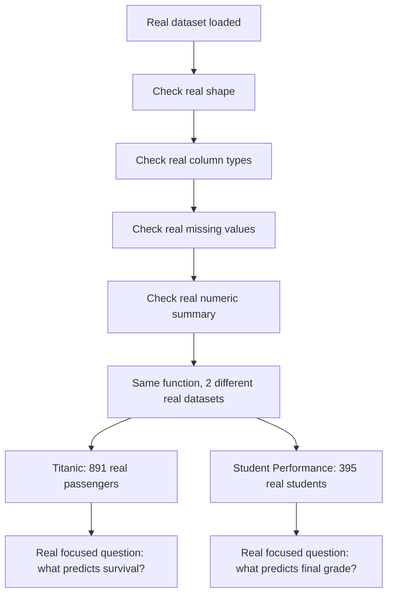

# 🔍 Practical 4 — Exploratory Data Analysis on Two Real Datasets

   

> 🔎 **The rule every data scientist follows:** never build a model on data you haven't actually looked at first. This practical runs a real, systematic first look at two completely different real datasets.

<p align="center"></p>

---

## 📋 Quick Facts

| | |
|---|---|
| 📦 Datasets | Real Titanic manifest (891 passengers) + real UCI Student Performance (395 students) |
| 🎯 Course outcome | CO2 — exploratory data analysis on real-world datasets |
| 🛠️ Tools | `pandas`, `matplotlib` |
| ⏱️ Time | About 2 hours |
| ✅ Tested | Every number and chart below is real output from running the code |

---

## 📑 Contents

1. [What You'll Build](#1-what-youll-build)
2. [Visual Overview](#2-visual-overview)
3. [The Theory — What EDA Actually Checks](#3-the-theory-what-eda-actually-checks)
4. [Tools — Why, What, How](#4-tools-why-what-how)
5. [The Datasets](#5-the-datasets)
6. [Setup](#6-setup)
7. [Code Walkthrough](#7-code-walkthrough)
8. [Full Code](#8-full-code)
9. [Google Colab Version](#9-google-colab-version)
10. [Try It Yourself](#10-try-it-yourself)
11. [Common Mistakes](#11-common-mistakes)
12. [Quiz](#12-quiz)
13. [Summary](#13-summary)

---

<a id="1-what-youll-build"></a>
## 1️⃣ What You'll Build

🎯 A real, reusable EDA function applied to two genuinely different real datasets — proving the same systematic checklist works regardless of domain: shape, column types, missing values, and numeric summary statistics.

| You will be able to... |
|---|
| ✅ Write one reusable real EDA function that works on any dataset |
| ✅ Spot real missing data before it causes silent bugs later |
| ✅ Find the real strongest correlates of a target variable |
| ✅ Compare two structurally different real datasets side by side |

---

<a id="2-visual-overview"></a>
## 2️⃣ Visual Overview



---

<a id="3-the-theory-what-eda-actually-checks"></a>
## 3️⃣ The Theory — What EDA Actually Checks

Every real EDA pass answers the same 4 real questions, regardless of the dataset's subject:

| Question | Why it matters |
|---|---|
| What's the real shape? | Tells you how much real data you have to work with |
| What are the real column types? | Numeric columns need different handling than real categorical/text columns |
| What's missing? | Missing real data can silently break later calculations or bias a model |
| What do the real numbers look like? | Mean, min, max, and quartiles reveal real outliers and scale differences |

---

<a id="4-tools-why-what-how"></a>
## 4️⃣ Tools — Why, What, How

| Library | Why | What we use | How |
|---|---|---|---|
| 🐼 `pandas` | Every real EDA check is a Pandas one-liner | `.shape`, `.dtypes`, `.isnull()`, `.describe()` | shown in [Section 7](#7-code-walkthrough) |
| 📊 `matplotlib` | Visualize real distributions side by side | `plt.subplots()`, `plt.scatter()` | shown in [Section 7](#7-code-walkthrough) |

---

<a id="5-the-datasets"></a>
## 5️⃣ The Datasets

📦 **Titanic** — 891 real passengers (reused from Practicals 2-3).

📦 **Student Performance** — 395 real Portuguese secondary school students, real UCI dataset (Cortez & Silva, 2008). Real features include study time, past failures, parental education, and 3 real grade checkpoints (`G1`, `G2`, `G3` — first period, second period, and final grade, each on a real 0-20 scale).

---

<a id="6-setup"></a>
## 6️⃣ Setup

```bash
pip install pandas matplotlib
```

```python
import os
import matplotlib.pyplot as plt
import pandas as pd
```

---

<a id="7-code-walkthrough"></a>
## 7️⃣ Code Walkthrough

### 🔹 Step 1 — One reusable real EDA function

```python
def eda_report(df, name):
    print(f"\n### EDA: {name} ###")
    print(f"Real shape: {df.shape[0]} rows, {df.shape[1]} columns")
    print(f"\nReal column types:\n{df.dtypes.value_counts()}")
    missing = df.isnull().sum()
    missing = missing[missing > 0]
    if len(missing):
        print(f"\nReal missing values:\n{missing}")
    else:
        print("\nNo real missing values.")
    print(f"\nReal numeric summary:\n{df.describe().round(2)}")
```

**What this does:** this single function runs identically on any real DataFrame — we call it twice, once per dataset, proving the same real EDA checklist generalizes.

**Real output (Titanic):**
```
Real shape: 891 rows, 12 columns
Real missing values:
Age         177
Cabin       687
Embarked      2
```

**Real output (Student Performance):**
```
Real shape: 395 rows, 33 columns
No real missing values.
```

🔎 A genuinely useful real contrast: Titanic has real missing data that must be handled (Practical 5 does exactly this), while the Student Performance dataset is real and complete — not every real dataset needs the same preprocessing.

---

### 🔹 Step 2 — A real focused question: what predicts the final grade?

```python
numeric_student = student.select_dtypes(include="number")
corr_with_g3 = numeric_student.corr()["G3"].drop("G3").sort_values(key=abs, ascending=False)
```

**Real output:**
```
Real top 5 correlates of final grade (G3):
G2          0.904868
G1          0.801468
failures   -0.360415
Medu        0.217147
age        -0.161579
```

🔎 A genuinely expected but reassuring real result: earlier real grades (`G1`, `G2`) are by far the strongest real predictors of the final grade — makes intuitive sense, and confirms the data behaves sensibly. Real past `failures` negatively correlates, as expected.

---

### 🔹 Step 3 — Real side-by-side visual comparison

```python
axes[0].hist(titanic["Age"].dropna(), bins=25, color="#2563eb")
axes[1].hist(student["G3"], bins=20, color="#16a34a")
```


🔎 Notice the real spike at `G3 = 0` in the student grade distribution — this represents real students who dropped out or didn't sit the final exam, a genuine real-world data quirk EDA catches before it silently skews a later model.


---

<a id="8-full-code"></a>
## 8️⃣ Full Code

```python
import os

import matplotlib.pyplot as plt
import pandas as pd

os.makedirs("images", exist_ok=True)


def eda_report(df, name):
    """A real, reusable EDA summary: shape, types, missing values, and
    basic real statistics -- the first things any real data scientist
    checks before doing anything else with a new dataset."""
    print(f"\n### EDA: {name} ###")
    print(f"Real shape: {df.shape[0]} rows, {df.shape[1]} columns")
    print(f"\nReal column types:\n{df.dtypes.value_counts()}")
    missing = df.isnull().sum()
    missing = missing[missing > 0]
    if len(missing):
        print(f"\nReal missing values:\n{missing}")
    else:
        print("\nNo real missing values.")
    print(f"\nReal numeric summary:\n{df.describe().round(2)}")


if __name__ == "__main__":
    titanic = pd.read_csv("../datasets/titanic.csv")
    eda_report(titanic, "Titanic (891 real passengers)")

    student = pd.read_csv("../datasets/student-mat.csv")
    eda_report(student, "Student Performance (395 real students)")

    # Real, focused comparison: what predicts the real final grade (G3)?
    print("\n### REAL FOCUSED QUESTION: WHAT PREDICTS STUDENT G3 (FINAL GRADE)? ###")
    numeric_student = student.select_dtypes(include="number")
    corr_with_g3 = numeric_student.corr()["G3"].drop("G3").sort_values(key=abs, ascending=False)
    print("Real top 5 correlates of final grade (G3):")
    print(corr_with_g3.head(5))

    fig, axes = plt.subplots(1, 2, figsize=(12, 5))
    axes[0].hist(titanic["Age"].dropna(), bins=25, color="#2563eb")
    axes[0].set_title("Real Titanic Age Distribution")
    axes[0].set_xlabel("Age")

    axes[1].hist(student["G3"], bins=20, color="#16a34a")
    axes[1].set_title("Real Student Final Grade (G3) Distribution")
    axes[1].set_xlabel("G3 (0-20 scale)")
    plt.tight_layout()
    plt.savefig("images/01_distributions_comparison.png")
    plt.close()

    plt.figure(figsize=(7, 5))
    plt.scatter(student["studytime"], student["G3"], alpha=0.5, color="#f97316")
    plt.xlabel("Real weekly study time (1=low, 4=high)")
    plt.ylabel("Real final grade (G3)")
    plt.title("Real Study Time vs Final Grade")
    plt.tight_layout()
    plt.savefig("images/02_studytime_vs_grade.png")
    plt.close()

    print("\nDone. 2 real charts saved in images/")
```

---

<a id="9-google-colab-version"></a>
## 9️⃣ Google Colab Version

**Setup cell:**
```python
!git clone https://github.com/<your-username>/CSE252-AI-ML-Practicals.git
%cd CSE252-AI-ML-Practicals/Practical-04-Exploratory-Data-Analysis
```

**Cell 1 — the reusable EDA function:**
```python
import pandas as pd

def eda_report(df, name):
    print(f"### EDA: {name} ###")
    print("Shape:", df.shape)
    print("Missing:\n", df.isnull().sum()[df.isnull().sum() > 0])
    print(df.describe())

titanic = pd.read_csv("../datasets/titanic.csv")
student = pd.read_csv("../datasets/student-mat.csv")
eda_report(titanic, "Titanic")
eda_report(student, "Student Performance")
```

**Cell 2 — correlation with final grade:**
```python
numeric_student = student.select_dtypes(include="number")
print(numeric_student.corr()["G3"].sort_values(key=abs, ascending=False))
```

---

<a id="10-try-it-yourself"></a>
## 🔟 Try It Yourself

1. 🔁 Run `eda_report()` on just the `student-mat.csv` numeric columns grouped by `sex` — any real differences?
2. 🧪 Find which real Titanic column has the most missing values, and by what percentage.
3. 📊 Plot `failures` vs `G3` as a boxplot — does more real past failure predict a lower final grade?
4. 🎯 Add a 3rd real dataset of your choice and confirm `eda_report()` works on it unmodified.

---

<a id="11-common-mistakes"></a>
## ⚠️ Common Mistakes

| Mistake | Fix |
|---|---|
| Skipping EDA and jumping straight to modeling | Real missing values or real outliers can silently break or bias a model |
| Assuming `.describe()` covers non-numeric columns | It only summarizes real numeric columns by default |
| Ignoring a real spike at 0 in a grade/score distribution | Often signals real dropouts or non-participants, not genuine zero scores |

---

<a id="12-quiz"></a>
## ❓ Quiz

1. What are the 4 real questions every EDA pass should answer?
2. Why does the Student Performance dataset need no missing-value handling, unlike Titanic?
3. What did the real correlation analysis reveal about predicting G3?

<details>
<summary>Answers</summary>

1. Real shape, real column types, real missing values, real numeric summary.
2. It's a genuinely complete real dataset — every real student's every attribute was recorded, unlike Titanic's historical records.
3. Earlier real grades (G1, G2) are by far the strongest predictors — unsurprising, but a valuable real sanity check.

</details>

---

<a id="13-summary"></a>
## 📝 Summary

| Dataset | Real missing data | Real key insight |
|---|---|---|
| Titanic | Age (177), Cabin (687), Embarked (2) | Real missing data must be handled before modeling |
| Student Performance | None | G1/G2 grades are the strongest real predictors of G3 |

## 📂 Files

| File | What it is |
|---|---|
| `eda_demo.py` | Full tested script |
| `images/01-02*.png` | 2 real generated charts |

⬅️ **Previous:** [Practical 3 — Matplotlib](../Practical-03-Matplotlib-Visualization/README.md) · ➡️ **Next:** Practical 5 — Data Preprocessing
