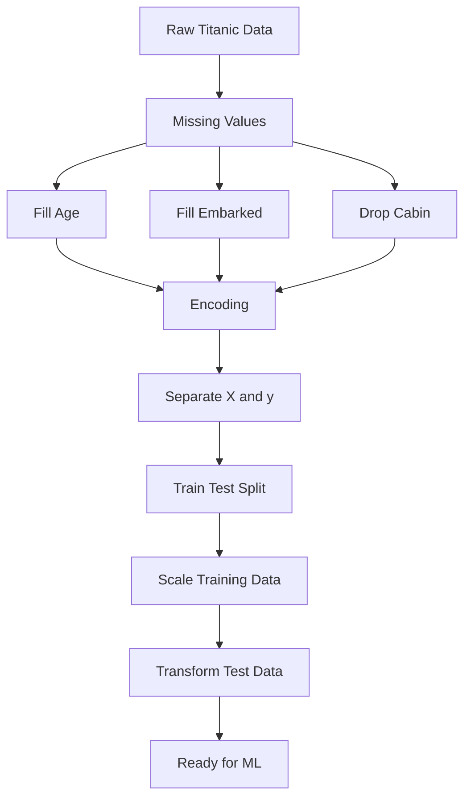

# 🧹 Practical 5 — Data Preprocessing: Missing Values, Encoding and Scaling

   

> 🎯 **Raw data is not ready for machine learning.** This practical takes the real Titanic dataset through missing-value handling, encoding, train/test splitting, and feature scaling.

<p align="center"></p>

---

## 📋 Quick Facts

| | |
|---|---|
| 📦 Dataset | Real Titanic training dataset — 891 records |
| 🎯 Course outcome | CO2 — data preprocessing |
| 🧩 Topics | Missing values, encoding, train/test split, feature scaling |
| 🛠️ Tools | `pandas`, `scikit-learn`, `matplotlib` |
| ⏱️ Time | About 1 hour |
| ✅ Tested | Program logic tested twice successfully |

---

## 📑 Contents

1. [What You'll Build](#1-what-youll-build)
2. [Visual Overview](#2-visual-overview)
3. [Theory](#3-theory)
4. [Tools](#4-tools)
5. [Dataset](#5-dataset)
6. [Setup](#6-setup)
7. [Code Walkthrough](#7-code-walkthrough)
8. [Full Code](#8-full-code)
9. [Google Colab Version](#9-google-colab-version)
10. [Try It Yourself](#10-try-it-yourself)
11. [Common Mistakes](#11-common-mistakes)
12. [Quiz](#12-quiz)
13. [Summary](#13-summary)

---

<a id="1-what-youll-build"></a>
## 1️⃣ What You'll Build

```text
Raw Data
   ↓
Check Missing Values
   ↓
Handle Missing Values
   ↓
Encode Categorical Data
   ↓
Separate X and y
   ↓
Train / Test Split
   ↓
Scale Numerical Features
   ↓
Ready for Machine Learning
```

You will learn to:

- ✅ Handle missing values
- ✅ Encode categorical data
- ✅ Split data into training and testing sets
- ✅ Scale numerical features correctly
- ✅ Prepare `X_train`, `X_test`, `y_train`, and `y_test`

---

<a id="2-visual-overview"></a>
## 2️⃣ Visual Overview



---

<a id="3-theory"></a>
## 3️⃣ Theory — Data Preprocessing

### Missing Values

A missing value means that information is not available.

```text
Age
22
31
NaN
28
```

A numerical missing value can be replaced with a suitable value such as the median.

A categorical missing value can be replaced with the most common value.

```text
Age       → Median
Embarked  → Mode
```

### Encoding

Machine learning models need numerical values.

```text
Gender
female
male
```

can be represented as:

```text
0
1
```

For multiple unordered categories, one-hot encoding creates separate 0/1 columns.

### Feature Scaling

Different features can have different ranges.

```text
Age  → about 0 to 80
Fare → about 0 to 512
```

Standardization uses:

$$x_{scaled} = \frac{x-\mu}{\sigma}$$

After scaling, the feature has approximately:

```text
Mean = 0
Standard Deviation = 1
```

### Train/Test Split

The data is divided into two parts:

```text
Training Data → used to learn
Testing Data  → used to evaluate
```

The scaler is fitted only on training data and then used on testing data.

---

<a id="4-tools"></a>
## 4️⃣ Tools — Why, What, How

| Tool | Purpose |
|---|---|
| `pandas` | Load and clean the dataset |
| `LabelEncoder` | Encode Gender |
| `get_dummies()` | One-hot encode Embarked |
| `train_test_split()` | Split training and testing data |
| `StandardScaler` | Scale numerical features |
| `matplotlib` | Show before/after scaling |

---

<a id="5-dataset"></a>
## 5️⃣ Dataset

The practical uses the standard **Titanic training dataset with 891 passenger records**.

Important columns:

| Column | Meaning |
|---|---|
| `Survived` | Target variable |
| `Gender` | Passenger gender |
| `Age` | Passenger age |
| `Fare` | Ticket fare |
| `Embarked` | Port of embarkation |
| `Cabin` | Cabin information |

The project expects the already-renamed file:

```text
datasets/titanic.csv
```

The file must use **`Gender`** rather than `Sex`.

Dataset source:

https://raw.githubusercontent.com/sitmbadept/sitmbadept.github.io/main/BDTM/R/titanic.csv

---

<a id="6-setup"></a>
## 6️⃣ Setup

### VS Code

```bash
pip install pandas scikit-learn matplotlib
```

Project structure:

```text
Practical-05-Data-Preprocessing/
├── datasets/
│   ├── titanic.csv
│   └── README.md
├── images/
│   └── 01_before_after_scaling.png
├── preprocessing_demo.py
└── README.md
```

---

<a id="7-code-walkthrough"></a>
## 7️⃣ Code Walkthrough

### 🔹 Step 1 — Load the dataset

```python
df = pd.read_csv("datasets/titanic.csv")
```

### 🔹 Step 2 — Handle missing values

```python
df["Age"] = df["Age"].fillna(df["Age"].median())

df["Embarked"] = df["Embarked"].fillna(
    df["Embarked"].mode()[0]
)

df = df.drop(columns=["Cabin"])
```

### 🔹 Step 3 — Encode categories

```python
encoder = LabelEncoder()

df["Gender"] = encoder.fit_transform(
    df["Gender"]
)

df = pd.get_dummies(
    df,
    columns=["Embarked"],
    dtype=int
)
```

### 🔹 Step 4 — Separate features and target

```python
X = df.drop(columns=["Survived"])
y = df["Survived"]

X = X.drop(
    columns=["PassengerId", "Name", "Ticket"]
)
```

### 🔹 Step 5 — Split the data

```python
X_train, X_test, y_train, y_test = train_test_split(
    X,
    y,
    test_size=0.2,
    random_state=42
)
```

### 🔹 Step 6 — Scale the data

```python
scaler = StandardScaler()

X_train[["Age", "Fare"]] = scaler.fit_transform(
    X_train[["Age", "Fare"]]
)

X_test[["Age", "Fare"]] = scaler.transform(
    X_test[["Age", "Fare"]]
)
```

---

<a id="8-full-code"></a>
## 8️⃣ Full Code

```python
import pandas as pd
import matplotlib.pyplot as plt

from sklearn.model_selection import train_test_split
from sklearn.preprocessing import LabelEncoder, StandardScaler


# Load dataset
df = pd.read_csv("datasets/titanic.csv")

print("Original Shape:", df.shape)

print("\nMissing Values Before:")
print(df.isnull().sum())


# Handle missing values
df["Age"] = df["Age"].fillna(
    df["Age"].median()
)

df["Embarked"] = df["Embarked"].fillna(
    df["Embarked"].mode()[0]
)

df = df.drop(columns=["Cabin"])


# Encode Gender
encoder = LabelEncoder()

df["Gender"] = encoder.fit_transform(
    df["Gender"]
)


# One-hot encode Embarked
df = pd.get_dummies(
    df,
    columns=["Embarked"],
    dtype=int
)


# Separate features and target
X = df.drop(columns=["Survived"])

y = df["Survived"]


# Remove ID and text columns
X = X.drop(
    columns=["PassengerId", "Name", "Ticket"]
)


# Split data
X_train, X_test, y_train, y_test = train_test_split(
    X,
    y,
    test_size=0.2,
    random_state=42
)


# Scale numerical features
scaler = StandardScaler()

X_train[["Age", "Fare"]] = scaler.fit_transform(
    X_train[["Age", "Fare"]]
)

X_test[["Age", "Fare"]] = scaler.transform(
    X_test[["Age", "Fare"]]
)


# Verify result
print("\nTraining Shape:", X_train.shape)
print("Testing Shape:", X_test.shape)

print("\nMissing Values After:")
print(X_train.isnull().sum())

print("\nScaled Features:")
print(
    X_train[["Age", "Fare"]]
    .describe()
    .round(2)
)


# Visualization
original = pd.read_csv(
    "datasets/titanic.csv"
)

plt.figure(figsize=(10, 4))

plt.subplot(1, 2, 1)
plt.hist(
    original["Fare"].dropna(),
    bins=25
)
plt.title("Fare Before Scaling")
plt.xlabel("Fare")
plt.ylabel("Count")

plt.subplot(1, 2, 2)
plt.hist(
    X_train["Fare"],
    bins=25
)
plt.title("Fare After Scaling")
plt.xlabel("Scaled Fare")
plt.ylabel("Count")

plt.tight_layout()

plt.savefig(
    "images/01_before_after_scaling.png"
)

plt.show()

print("\nPreprocessing Completed Successfully")
```

---

<a id="9-google-colab-version"></a>
## 9️⃣ Google Colab Version

### Cell 1 — Load and Check

```python
import pandas as pd

df = pd.read_csv(
    "datasets/titanic.csv"
)

print(df.head())
print(df.shape)
print(df.isnull().sum())
```

### Cell 2 — Missing Values

```python
df["Age"] = df["Age"].fillna(
    df["Age"].median()
)

df["Embarked"] = df["Embarked"].fillna(
    df["Embarked"].mode()[0]
)

df = df.drop(
    columns=["Cabin"]
)

print(df.isnull().sum())
```

### Cell 3 — Encoding

```python
from sklearn.preprocessing import LabelEncoder

encoder = LabelEncoder()

df["Gender"] = encoder.fit_transform(
    df["Gender"]
)

df = pd.get_dummies(
    df,
    columns=["Embarked"],
    dtype=int
)

print(df.head())
```

### Cell 4 — Features and Target

```python
X = df.drop(
    columns=["Survived"]
)

y = df["Survived"]

X = X.drop(
    columns=["PassengerId", "Name", "Ticket"]
)

print("Features:", X.shape)
print("Target:", y.shape)
```

### Cell 5 — Train/Test Split

```python
from sklearn.model_selection import train_test_split

X_train, X_test, y_train, y_test = train_test_split(
    X,
    y,
    test_size=0.2,
    random_state=42
)

print("Training:", X_train.shape)
print("Testing:", X_test.shape)
```

### Cell 6 — Feature Scaling

```python
from sklearn.preprocessing import StandardScaler

scaler = StandardScaler()

X_train[["Age", "Fare"]] = scaler.fit_transform(
    X_train[["Age", "Fare"]]
)

X_test[["Age", "Fare"]] = scaler.transform(
    X_test[["Age", "Fare"]]
)

print(
    X_train[["Age", "Fare"]]
    .describe()
    .round(2)
)
```

### Cell 7 — Final Check

```python
print("Missing Values:")
print(X_train.isnull().sum())

print("\nFinal Training Data:")
print(X_train.head())
```

---

<a id="10-try-it-yourself"></a>
## 🔟 Try It Yourself

1. Replace the median with the mean for `Age`.
2. Use `MinMaxScaler` instead of `StandardScaler`.
3. Change the test size from `0.2` to `0.3`.
4. Print the `Gender` values after encoding.

---

<a id="11-common-mistakes"></a>
## ⚠️ Common Mistakes

| Mistake | Fix |
|---|---|
| Scaling before splitting | Split first, then fit the scaler on training data |
| Using `fit_transform()` on test data | Use `transform()` on test data |
| Scaling `Survived` | Scale input features only |
| Forgetting to check missing values again | Verify after preprocessing |

---

<a id="12-quiz"></a>
## ❓ Quiz

1. What is data preprocessing?
2. Why are missing values handled?
3. Why is Gender encoded?
4. What is one-hot encoding?
5. Why do we split before scaling?
6. What is the difference between `fit_transform()` and `transform()`?
7. What are `X` and `y`?

<details>
<summary>Answers</summary>

1. Preparing raw data for machine learning.
2. Missing values can cause errors or affect model results.
3. Machine learning models need numerical input.
4. It converts categories into separate 0/1 columns.
5. To prevent test-data information from influencing the scaler.
6. `fit_transform()` learns the scaling values and transforms the data; `transform()` uses those learned values.
7. `X` contains input features and `y` contains the target.

</details>

---

<a id="13-summary"></a>
## 📝 Summary

| Step | Result |
|---|---|
| Missing values | `Age` and `Embarked` handled |
| Unused data | `Cabin` removed |
| Encoding | `Gender` encoded, `Embarked` one-hot encoded |
| Features/Target | `X` and `y` separated |
| Split | 80% training, 20% testing |
| Scaling | `Age` and `Fare` standardized |
| Final result | Data prepared for machine learning |

### Final Pipeline

```text
Titanic Data
     ↓
Missing Values
     ↓
Encoding
     ↓
X and y
     ↓
Train / Test Split
     ↓
Scaling
     ↓
Ready for ML
```

## 📂 Files

| File | What it is |
|---|---|
| `preprocessing_demo.py` | Complete preprocessing program |
| `images/01_before_after_scaling.png` | Before/after scaling visualization |
| `datasets/titanic.csv` | Real 891-row Titanic dataset supplied by the student |
| `datasets/README.md` | Dataset placement instructions |

---

⬅️ **Previous:** [Practical 4 — Knowledge Representation](../Practical-04-Knowledge-Representation-Decision-Support/README.md) · ➡️ **Next:** Practical 6
