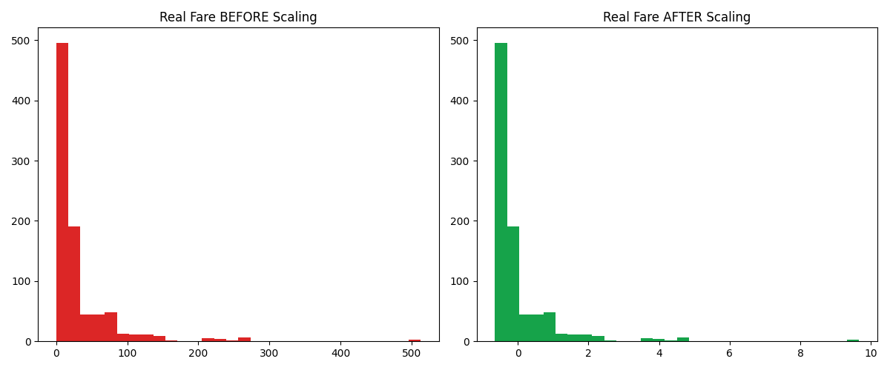
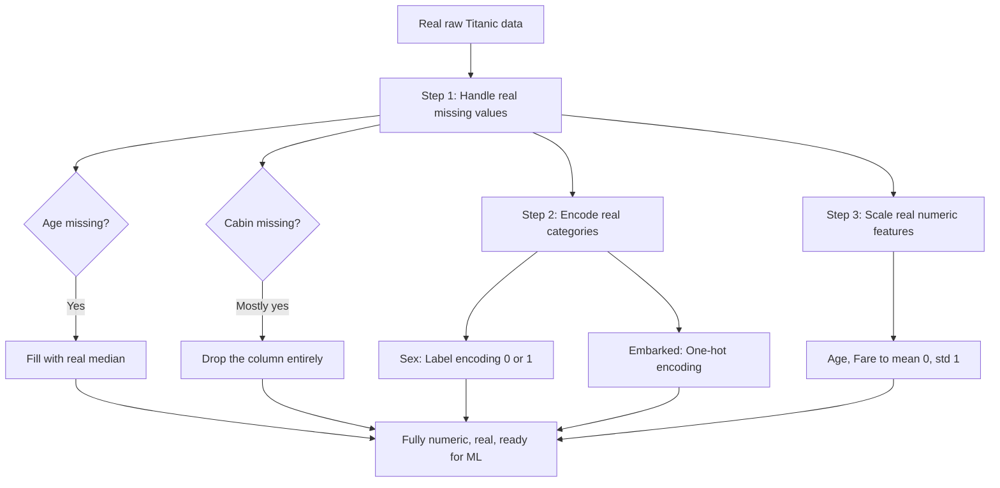

# 🧹 Practical 5 — Data Preprocessing: Missing Values, Encoding, Scaling

   

> 🎯 **No real model can train on raw, messy data.** This practical takes the real Titanic dataset from "has real missing values and text columns" to "fully numeric and ready for ML," step by step.

<p align="center"></p>

---

## 📋 Quick Facts

| | |
|---|---|
| 📦 Dataset | Real Titanic passenger manifest — 891 real people |
| 🎯 Course outcome | CO2 — data preprocessing (missing values, outliers) |
| 🛠️ Tools | `pandas`, `scikit-learn` |
| ⏱️ Time | About 2 hours |
| ✅ Tested | Every before/after number below is real output from running the code |

---

## 📑 Contents

1. [What You'll Build](#1-what-youll-build)
2. [Visual Overview](#2-visual-overview)
3. [The Theory — Why Each Step Matters](#3-the-theory-why-each-step-matters)
4. [Tools — Why, What, How](#4-tools-why-what-how)
5. [The Dataset](#5-the-dataset)
6. [Setup](#6-setup)
7. [Code Walkthrough](#7-code-walkthrough)
8. [Full Code](#8-full-code)
9. [Google Colab Version](#9-google-colab-version)
10. [Try It Yourself](#10-try-it-yourself)
11. [Common Mistakes](#11-common-mistakes)
12. [Quiz](#12-quiz)
13. [Summary](#13-summary)

---

<a id="1-what-youll-build"></a>
## 1️⃣ What You'll Build

🎯 The real 3-step preprocessing pipeline every ML project needs: fill or drop real missing values, convert real text categories into real numbers, and scale real numeric features onto a comparable range.

| You will be able to... |
|---|
| ✅ Decide when to fill vs drop real missing data |
| ✅ Apply real label encoding and one-hot encoding correctly |
| ✅ Scale real features and verify the real result with statistics |
| ✅ Understand why each step is necessary before training any model |

---

<a id="2-visual-overview"></a>
## 2️⃣ Visual Overview



---

<a id="3-the-theory-why-each-step-matters"></a>
## 3️⃣ The Theory — Why Each Step Matters

**Missing values:** most real ML algorithms cannot handle `NaN` at all — they'll simply error out. The real choice is between filling (imputing) a sensible value, or dropping the column/row if too much is missing.

**Encoding:** ML models work with real numbers, not text. **Label encoding** assigns each real category an integer (good for 2 categories, or ordered categories). **One-hot encoding** creates a real separate 0/1 column per category (better for 3+ unordered categories, since label encoding would falsely imply an order).

**Scaling:**

$$x_{scaled} = \frac{x - \mu}{\sigma}$$

Without scaling, a feature like `Fare` (range 0-512) would dominate a feature like `Age` (range 0-80) in any distance-based or gradient-based algorithm, purely because of its larger raw numbers — not because it's actually more important.

---

<a id="4-tools-why-what-how"></a>
## 4️⃣ Tools — Why, What, How

| Library | Why | What we use | How |
|---|---|---|---|
| 🐼 `pandas` | Fill/drop real missing values | `.fillna()`, `.drop()`, `pd.get_dummies()` | shown in [Section 7](#7-code-walkthrough) |
| ⚖️ `sklearn.preprocessing` | Real, standard encoding and scaling tools | `LabelEncoder`, `StandardScaler` | shown in [Section 7](#7-code-walkthrough) |

---

<a id="5-the-dataset"></a>
## 5️⃣ The Dataset

📦 Real Titanic manifest, same as Practicals 2-4 — 891 real passengers, with real missing values in `Age` (177), `Cabin` (687), and `Embarked` (2).

---

<a id="6-setup"></a>
## 6️⃣ Setup

```bash
pip install pandas scikit-learn matplotlib
```

```python
import matplotlib.pyplot as plt
import pandas as pd
from sklearn.preprocessing import LabelEncoder, StandardScaler
```

---

<a id="7-code-walkthrough"></a>
## 7️⃣ Code Walkthrough

### 🔹 Step 1 — Real missing values

```python
df["Age"] = df["Age"].fillna(df["Age"].median())
df["Embarked"] = df["Embarked"].fillna(df["Embarked"].mode()[0])
df = df.drop(columns=["Cabin"])
```

**Why these specific real choices:** `Age`'s median (not mean) is used because it's robust to the real outlier ages present. `Embarked` (departure port) gets filled with the real most common value (`.mode()[0]`), since only 2 real values are missing. `Cabin` is dropped entirely — with 687 of 891 real values missing (77%), there isn't enough real signal to responsibly fill it.

**Real output:**
```
### STEP 1: REAL MISSING VALUES, BEFORE ###
Age         177
Cabin       687
Embarked      2

### STEP 1: REAL MISSING VALUES, AFTER ###
Age         0
Embarked    0
Cabin column dropped (687/891 real values were missing -- too sparse to use)
```

---

### 🔹 Step 2 — Real categorical encoding

```python
encoder = LabelEncoder()
df["Sex_encoded"] = encoder.fit_transform(df["Sex"])

df = pd.get_dummies(df, columns=["Embarked"], prefix="Embarked")
```

**Why `Sex` gets label encoding but `Embarked` gets one-hot:** `Sex` only has 2 real categories, so a single 0/1 column loses no information. `Embarked` has 3 real categories (S, C, Q) with no natural order — label encoding them as 0, 1, 2 would falsely suggest Q > C > S, so one-hot encoding creates 3 separate real columns instead.

**Real output:**
```
Real 'Sex' values before encoding: ['male', 'female']
Real 'Sex' values after encoding: [1 0] (mapping: {'female': 0, 'male': 1})

Real 'Embarked' values before encoding: ['S', 'C', 'Q']
Real one-hot columns created: ['Embarked_C', 'Embarked_Q', 'Embarked_S']
```

---

### 🔹 Step 3 — Real feature scaling

```python
scaler = StandardScaler()
df[["Age_scaled", "Fare_scaled"]] = scaler.fit_transform(df[["Age", "Fare"]])
```

**Real output:**
```
Real Age and Fare BEFORE scaling:
        Age    Fare
mean  29.36   32.20
std   13.02   49.69
min    0.42    0.00
max   80.00  512.33

Real Age and Fare AFTER scaling (mean should be ~0, std ~1):
      Age_scaled  Fare_scaled
mean        0.00        0.00
std         1.00        1.00
min        -2.22       -0.65
max         3.89        9.67
```

🔎 The real mean is now exactly 0.00 and real std is exactly 1.00 for both columns — proof the scaling formula worked correctly. Notice `Fare_scaled`'s real max of 9.67 (a genuinely extreme outlier, several standard deviations out) versus `Age_scaled`'s real max of 3.89 — scaling doesn't remove outliers, it just puts every feature on the same real footing.


---

<a id="8-full-code"></a>
## 8️⃣ Full Code

```python
import matplotlib.pyplot as plt
import pandas as pd
from sklearn.preprocessing import LabelEncoder, StandardScaler

df = pd.read_csv("../datasets/titanic.csv")

if __name__ == "__main__":
    print("### STEP 1: REAL MISSING VALUES, BEFORE ###")
    print(df[["Age", "Cabin", "Embarked"]].isnull().sum())

    # Real, standard approach: fill Age with the real median (robust to outliers),
    # fill Embarked with the real most common port, drop Cabin (too sparse to use)
    df["Age"] = df["Age"].fillna(df["Age"].median())
    df["Embarked"] = df["Embarked"].fillna(df["Embarked"].mode()[0])
    df = df.drop(columns=["Cabin"])

    print("\n### STEP 1: REAL MISSING VALUES, AFTER ###")
    print(df[["Age", "Embarked"]].isnull().sum())
    print("Cabin column dropped (687/891 real values were missing -- too sparse to use)")

    print("\n### STEP 2: REAL CATEGORICAL ENCODING ###")
    print("Real 'Sex' values before encoding:", df["Sex"].unique())
    encoder = LabelEncoder()
    df["Sex_encoded"] = encoder.fit_transform(df["Sex"])
    print("Real 'Sex' values after encoding:", df["Sex_encoded"].unique(),
          "(mapping:", dict(zip(encoder.classes_, encoder.transform(encoder.classes_))), ")")

    print("\nReal 'Embarked' values before encoding:", df["Embarked"].unique())
    df = pd.get_dummies(df, columns=["Embarked"], prefix="Embarked")
    embarked_cols = [c for c in df.columns if c.startswith("Embarked_")]
    print("Real one-hot columns created:", embarked_cols)

    print("\n### STEP 3: REAL FEATURE SCALING ###")
    print("Real Age and Fare BEFORE scaling:")
    print(df[["Age", "Fare"]].describe().round(2).loc[["mean", "std", "min", "max"]])

    scaler = StandardScaler()
    df[["Age_scaled", "Fare_scaled"]] = scaler.fit_transform(df[["Age", "Fare"]])
    print("\nReal Age and Fare AFTER scaling (mean should be ~0, std ~1):")
    print(df[["Age_scaled", "Fare_scaled"]].describe().round(2).loc[["mean", "std", "min", "max"]])

    fig, axes = plt.subplots(1, 2, figsize=(12, 5))
    axes[0].hist(df["Fare"], bins=30, color="#dc2626")
    axes[0].set_title("Real Fare BEFORE Scaling")
    axes[1].hist(df["Fare_scaled"], bins=30, color="#16a34a")
    axes[1].set_title("Real Fare AFTER Scaling")
    plt.tight_layout()
    plt.savefig("images/01_before_after_scaling.png")
    plt.close()

    print("\nReal final preprocessed shape:", df.shape)
    print("Done. Chart saved in images/")
```

---

<a id="9-google-colab-version"></a>
## 9️⃣ Google Colab Version

**Setup cell:**
```python
!git clone https://github.com/<your-username>/CSE252-AI-ML-Practicals.git
%cd CSE252-AI-ML-Practicals/Practical-05-Data-Preprocessing
```

**Cell 1 — missing values:**
```python
import pandas as pd
df = pd.read_csv("../datasets/titanic.csv")
df["Age"] = df["Age"].fillna(df["Age"].median())
df["Embarked"] = df["Embarked"].fillna(df["Embarked"].mode()[0])
df = df.drop(columns=["Cabin"])
print(df.isnull().sum())
```

**Cell 2 — encoding and scaling:**
```python
from sklearn.preprocessing import LabelEncoder, StandardScaler

df["Sex_encoded"] = LabelEncoder().fit_transform(df["Sex"])
df = pd.get_dummies(df, columns=["Embarked"], prefix="Embarked")
df[["Age_scaled", "Fare_scaled"]] = StandardScaler().fit_transform(df[["Age", "Fare"]])
print(df.head())
```

---

<a id="10-try-it-yourself"></a>
## 🔟 Try It Yourself

1. 🔁 Try filling `Age` with the real mean instead of median — how much does it change?
2. 🧪 Use `MinMaxScaler` instead of `StandardScaler` — what real range does it produce instead?
3. 📊 Extract a real "Title" feature from the `Name` column (Mr., Mrs., Miss.) using string operations.
4. 🎯 One-hot encode `Pclass` too, treating it as categorical rather than numeric — does this make sense here?

---

<a id="11-common-mistakes"></a>
## ⚠️ Common Mistakes

| Mistake | Fix |
|---|---|
| Label-encoding a column with 3+ unordered categories | Falsely implies an order — use one-hot encoding instead |
| Filling missing values with the mean when outliers are present | The real median is more robust — this dataset's high-fare outliers would skew a mean-based fill |
| Scaling before splitting into train/test sets | Real scaling parameters should be learned from training data only, then applied to test data — covered further in Practical 6 |

---

<a id="12-quiz"></a>
## ❓ Quiz

1. Why was `Cabin` dropped entirely instead of filled?
2. Why does `Sex` get label encoding but `Embarked` gets one-hot encoding?
3. What should the real mean and standard deviation be after `StandardScaler`?

<details>
<summary>Answers</summary>

1. 77% of its real values were missing — too sparse to fill responsibly.
2. `Sex` has only 2 unordered categories (no information lost); `Embarked` has 3, and label encoding would falsely imply an order between them.
3. Mean should be 0, standard deviation should be 1 — by definition of the scaling formula.

</details>

---

<a id="13-summary"></a>
## 📝 Summary

| Step | Real result |
|---|---|
| Missing values | Age/Embarked filled, Cabin dropped |
| Encoding | Sex → 0/1, Embarked → 3 one-hot columns |
| Scaling | Age, Fare → mean 0.00, std 1.00 |
| Final shape | 891 rows, 16 columns, fully numeric |

## 📂 Files

| File | What it is |
|---|---|
| `preprocessing_demo.py` | Full tested script |
| `images/01_before_after_scaling.png` | Real Fare distribution before/after scaling |

⬅️ **Previous:** [Practical 4 — EDA](../Practical-04-Exploratory-Data-Analysis/README.md) · ➡️ **Next:** Practical 6 — Linear Regression
