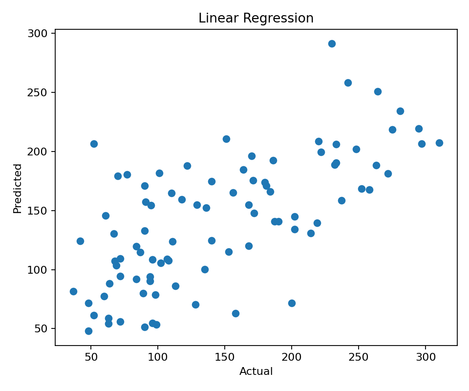

# 📈 Practical 6 — Linear Regression

   

<p align="center"></p>

## 🎯 Aim
To implement **Linear Regression** for predicting a continuous numerical value.

## 🧠 Theory
Linear Regression learns a relationship between input features and a numerical target.

$$y = b_0 + b_1x_1 + b_2x_2 + \cdots + b_nx_n$$

**MAE** = average absolute error  
**MSE** = average squared error  
**R²** = how well the model explains the target

## 🔄 Workflow
```text
Real Data → Split → Train → Predict → Evaluate → Visualize
```

## 📦 Dataset
Real scikit-learn **Diabetes dataset**:
- 442 records
- 10 input features
- Continuous target

## ⚙️ Setup
```bash
pip install scikit-learn matplotlib
```

## 💻 Full Code
```python
import matplotlib.pyplot as plt
from sklearn.datasets import load_diabetes
from sklearn.model_selection import train_test_split
from sklearn.linear_model import LinearRegression
from sklearn.metrics import mean_absolute_error, mean_squared_error, r2_score

data = load_diabetes(as_frame=True)
X, y = data.data, data.target

X_train, X_test, y_train, y_test = train_test_split(
    X, y, test_size=0.2, random_state=42
)

model = LinearRegression()
model.fit(X_train, y_train)

prediction = model.predict(X_test)

print("MAE:", round(mean_absolute_error(y_test, prediction), 2))
print("MSE:", round(mean_squared_error(y_test, prediction), 2))
print("R2 :", round(r2_score(y_test, prediction), 2))

plt.scatter(y_test, prediction)
plt.xlabel("Actual")
plt.ylabel("Predicted")
plt.title("Linear Regression")
plt.show()
```

## ☁️ Google Colab

### Cell 1 — Load Data
```python
from sklearn.datasets import load_diabetes

data = load_diabetes(as_frame=True)
X, y = data.data, data.target
```

### Cell 2 — Split and Train
```python
from sklearn.model_selection import train_test_split
from sklearn.linear_model import LinearRegression

X_train, X_test, y_train, y_test = train_test_split(
    X, y, test_size=0.2, random_state=42
)

model = LinearRegression()
model.fit(X_train, y_train)
```

### Cell 3 — Predict and Evaluate
```python
from sklearn.metrics import mean_absolute_error, mean_squared_error, r2_score

prediction = model.predict(X_test)

print("MAE:", mean_absolute_error(y_test, prediction))
print("MSE:", mean_squared_error(y_test, prediction))
print("R2 :", r2_score(y_test, prediction))
```

### Cell 4 — Visualize
```python
import matplotlib.pyplot as plt

plt.scatter(y_test, prediction)
plt.xlabel("Actual")
plt.ylabel("Predicted")
plt.title("Linear Regression")
plt.show()
```

## ❓ Viva
**What is Linear Regression?** A model for predicting a continuous value.  
**What is R²?** A measure of how well the model explains the target.  
**Why split the data?** To test on unseen data.

## 📝 Summary
```text
Data → Linear Regression → Prediction → Evaluation
```

## 📂 Files
| File | Purpose |
|---|---|
| `linear_regression.py` | Complete program |
| `images/01_actual_vs_predicted.png` | Prediction visualization |

⬅️ Previous: Practical 5 · ➡️ Next: Practical 7
