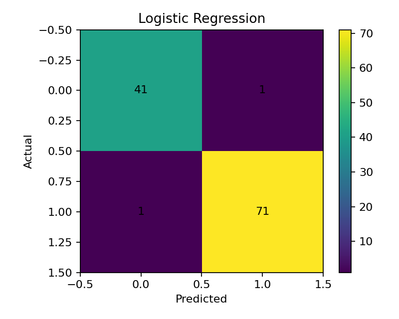

# 🧠 Practical 7 — Logistic Regression

   

<p align="center"></p>

## 🎯 Aim
To implement **Logistic Regression** for binary classification.

## 🧠 Theory
Logistic Regression estimates the probability of a class.

$$P(y=1)=\frac{1}{1+e^{-z}}$$

The probability is converted into a class prediction.

A **confusion matrix** shows correct and incorrect predictions for each class.

## 🔄 Workflow
```text
Real Data → Split → Scale → Train → Predict → Accuracy
                                      ↓
                              Confusion Matrix
```

## 📦 Dataset
Real scikit-learn **Breast Cancer dataset**:
- 569 records
- 30 numerical features
- Binary target

## ⚙️ Setup
```bash
pip install scikit-learn matplotlib
```

## 💻 Full Code
```python
import matplotlib.pyplot as plt
from sklearn.datasets import load_breast_cancer
from sklearn.model_selection import train_test_split
from sklearn.preprocessing import StandardScaler
from sklearn.linear_model import LogisticRegression
from sklearn.metrics import accuracy_score, confusion_matrix

data = load_breast_cancer(as_frame=True)
X, y = data.data, data.target

X_train, X_test, y_train, y_test = train_test_split(
    X, y, test_size=0.2, random_state=42, stratify=y
)

scaler = StandardScaler()
X_train = scaler.fit_transform(X_train)
X_test = scaler.transform(X_test)

model = LogisticRegression(max_iter=1000)
model.fit(X_train, y_train)

prediction = model.predict(X_test)

print("Accuracy:", round(accuracy_score(y_test, prediction), 2))
print("Confusion Matrix:\\n", confusion_matrix(y_test, prediction))

plt.imshow(confusion_matrix(y_test, prediction))
plt.title("Logistic Regression")
plt.xlabel("Predicted")
plt.ylabel("Actual")
plt.colorbar()
plt.show()
```

## ☁️ Google Colab

### Cell 1 — Load Data
```python
from sklearn.datasets import load_breast_cancer

data = load_breast_cancer(as_frame=True)
X, y = data.data, data.target
```

### Cell 2 — Split and Scale
```python
from sklearn.model_selection import train_test_split
from sklearn.preprocessing import StandardScaler

X_train, X_test, y_train, y_test = train_test_split(
    X, y, test_size=0.2, random_state=42, stratify=y
)

scaler = StandardScaler()
X_train = scaler.fit_transform(X_train)
X_test = scaler.transform(X_test)
```

### Cell 3 — Train and Predict
```python
from sklearn.linear_model import LogisticRegression

model = LogisticRegression(max_iter=1000)
model.fit(X_train, y_train)

prediction = model.predict(X_test)
```

### Cell 4 — Evaluate
```python
from sklearn.metrics import accuracy_score, confusion_matrix

matrix = confusion_matrix(y_test, prediction)

print("Accuracy:", accuracy_score(y_test, prediction))
print("\nConfusion Matrix:\\n", matrix)
```

### Cell 5 — Visualize
```python
import matplotlib.pyplot as plt

plt.imshow(matrix)
plt.title("Confusion Matrix")
plt.xlabel("Predicted")
plt.ylabel("Actual")
plt.colorbar()
plt.show()
```

## ❓ Viva
**Why scale?** To put features on a comparable scale.  
**What is sigmoid?** A function that gives a probability between 0 and 1.  
**What is a confusion matrix?** A table of class prediction results.

## 📝 Summary
```text
Data → Scale → Logistic Regression → Prediction → Accuracy
```

## 📂 Files
| File | Purpose |
|---|---|
| `logistic_regression.py` | Complete program |
| `images/01_confusion_matrix.png` | Confusion matrix |

⬅️ Previous: Practical 6 · ➡️ Next: Practical 8
