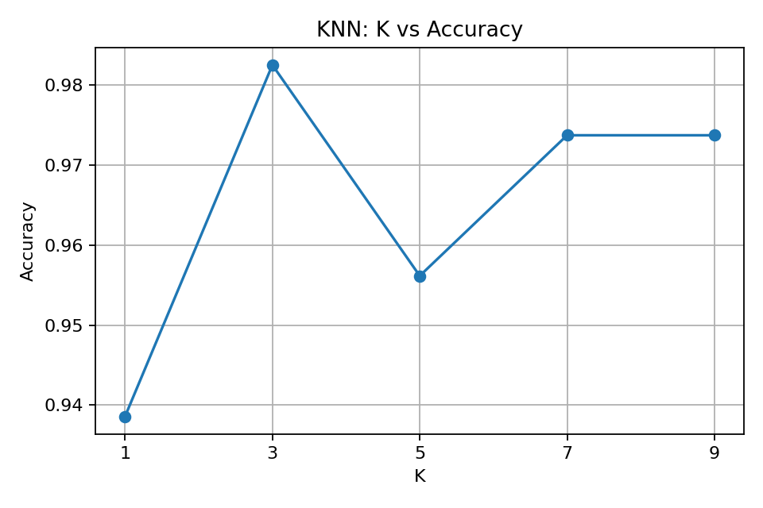

# 🧭 Practical 8 — K-Nearest Neighbour Classification

   

<p align="center"></p>

## 🎯 Aim
To implement **K-Nearest Neighbour (KNN)** classification and study the effect of `K`.

## 🧠 Theory
KNN predicts the class of a new point using its nearest training examples.

```text
New Point
   ↓
Find K nearest points
   ↓
Majority Vote
   ↓
Prediction
```

A small `K` can be sensitive to individual points, while a larger `K` gives a wider neighbourhood.

Because KNN uses distance, feature scaling is important.

## 🔄 Workflow
```text
Real Data → Split → Scale → Choose K → KNN → Accuracy
```

## 📦 Dataset
Real scikit-learn **Breast Cancer dataset**:
- 569 records
- 30 numerical features
- Binary target

## ⚙️ Setup
```bash
pip install scikit-learn matplotlib
```

## 💻 Full Code
```python
import matplotlib.pyplot as plt
from sklearn.datasets import load_breast_cancer
from sklearn.model_selection import train_test_split
from sklearn.preprocessing import StandardScaler
from sklearn.neighbors import KNeighborsClassifier
from sklearn.metrics import accuracy_score

data = load_breast_cancer(as_frame=True)
X, y = data.data, data.target

X_train, X_test, y_train, y_test = train_test_split(
    X, y, test_size=0.2, random_state=42, stratify=y
)

scaler = StandardScaler()
X_train = scaler.fit_transform(X_train)
X_test = scaler.transform(X_test)

k_values = [1, 3, 5, 7, 9]
accuracy = []

for k in k_values:
    model = KNeighborsClassifier(n_neighbors=k)
    model.fit(X_train, y_train)
    accuracy.append(
        accuracy_score(y_test, model.predict(X_test))
    )

print("K=5 Accuracy:", round(accuracy[2], 2))

plt.plot(k_values, accuracy, marker="o")
plt.xlabel("K")
plt.ylabel("Accuracy")
plt.title("KNN: K vs Accuracy")
plt.show()
```

## ☁️ Google Colab

### Cell 1 — Load and Split
```python
from sklearn.datasets import load_breast_cancer
from sklearn.model_selection import train_test_split

data = load_breast_cancer(as_frame=True)
X, y = data.data, data.target

X_train, X_test, y_train, y_test = train_test_split(
    X, y, test_size=0.2, random_state=42, stratify=y
)
```

### Cell 2 — Scale
```python
from sklearn.preprocessing import StandardScaler

scaler = StandardScaler()
X_train = scaler.fit_transform(X_train)
X_test = scaler.transform(X_test)
```

### Cell 3 — KNN
```python
from sklearn.neighbors import KNeighborsClassifier
from sklearn.metrics import accuracy_score

model = KNeighborsClassifier(n_neighbors=5)
model.fit(X_train, y_train)

prediction = model.predict(X_test)

print("Accuracy:", accuracy_score(y_test, prediction))
```

### Cell 4 — Compare K
```python
k_values = [1, 3, 5, 7, 9]

for k in k_values:
    model = KNeighborsClassifier(n_neighbors=k)
    model.fit(X_train, y_train)

    prediction = model.predict(X_test)

    print(
        "K =", k,
        "Accuracy =", round(
            accuracy_score(y_test, prediction), 2
        )
    )
```

### Cell 5 — Visualize
```python
import matplotlib.pyplot as plt

accuracy = []

for k in k_values:
    model = KNeighborsClassifier(n_neighbors=k)
    model.fit(X_train, y_train)
    accuracy.append(
        accuracy_score(
            y_test,
            model.predict(X_test)
        )
    )

plt.plot(k_values, accuracy, marker="o")
plt.xlabel("K")
plt.ylabel("Accuracy")
plt.title("KNN: K vs Accuracy")
plt.show()
```

## ❓ Viva
**What is KNN?** A distance-based classifier.  
**What is K?** Number of neighbours considered.  
**Why scale?** KNN uses distance.

## 📝 Summary
```text
Data → Scale → K Neighbours → Vote → Prediction
```

## 📂 Files
| File | Purpose |
|---|---|
| `knn_classification.py` | Complete program |
| `images/01_k_vs_accuracy.png` | K comparison |

⬅️ Previous: Practical 7 · ➡️ Next: Practical 9
