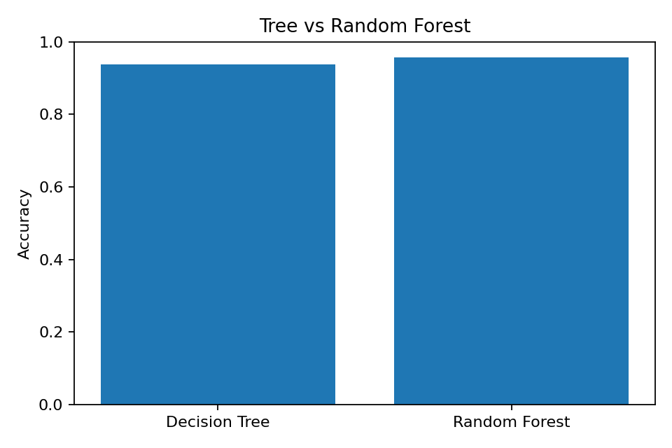

# 🌳 Practical 9 — Decision Tree and Random Forest

   

<p align="center"></p>

## 🎯 Aim
To implement **Decision Tree** and **Random Forest** classification and compare their accuracy.

## 🧠 Theory

### Decision Tree
A Decision Tree makes predictions through a sequence of feature-based decisions.

### Random Forest
Random Forest combines many Decision Trees and combines their predictions.

```text
Decision Tree → One Tree
Random Forest → Many Trees → Final Prediction
```

Unlike KNN and Logistic Regression, these tree-based models do not require feature scaling.

## 🔄 Workflow
```text
Real Data → Split → Tree + Forest → Predict → Compare Accuracy
```

## 📦 Dataset
Real scikit-learn **Breast Cancer dataset**:
- 569 records
- 30 numerical features
- Binary target

## ⚙️ Setup
```bash
pip install scikit-learn matplotlib
```

## 💻 Full Code
```python
import matplotlib.pyplot as plt
from sklearn.datasets import load_breast_cancer
from sklearn.model_selection import train_test_split
from sklearn.tree import DecisionTreeClassifier
from sklearn.ensemble import RandomForestClassifier
from sklearn.metrics import accuracy_score

data = load_breast_cancer(as_frame=True)
X, y = data.data, data.target

X_train, X_test, y_train, y_test = train_test_split(
    X, y, test_size=0.2, random_state=42, stratify=y
)

tree = DecisionTreeClassifier(
    max_depth=4, random_state=42
)

forest = RandomForestClassifier(
    n_estimators=100, random_state=42
)

tree.fit(X_train, y_train)
forest.fit(X_train, y_train)

tree_accuracy = accuracy_score(
    y_test, tree.predict(X_test)
)

forest_accuracy = accuracy_score(
    y_test, forest.predict(X_test)
)

print("Decision Tree:", round(tree_accuracy, 2))
print("Random Forest:", round(forest_accuracy, 2))

plt.bar(
    ["Decision Tree", "Random Forest"],
    [tree_accuracy, forest_accuracy]
)
plt.ylim(0, 1)
plt.ylabel("Accuracy")
plt.title("Tree vs Random Forest")
plt.show()
```

## ☁️ Google Colab

### Cell 1 — Load and Split
```python
from sklearn.datasets import load_breast_cancer
from sklearn.model_selection import train_test_split

data = load_breast_cancer(as_frame=True)
X, y = data.data, data.target

X_train, X_test, y_train, y_test = train_test_split(
    X, y, test_size=0.2, random_state=42, stratify=y
)
```

### Cell 2 — Decision Tree
```python
from sklearn.tree import DecisionTreeClassifier

tree = DecisionTreeClassifier(
    max_depth=4, random_state=42
)

tree.fit(X_train, y_train)
tree_prediction = tree.predict(X_test)
```

### Cell 3 — Random Forest
```python
from sklearn.ensemble import RandomForestClassifier

forest = RandomForestClassifier(
    n_estimators=100, random_state=42
)

forest.fit(X_train, y_train)
forest_prediction = forest.predict(X_test)
```

### Cell 4 — Compare
```python
from sklearn.metrics import accuracy_score

tree_accuracy = accuracy_score(
    y_test, tree_prediction
)

forest_accuracy = accuracy_score(
    y_test, forest_prediction
)

print("Decision Tree:", round(tree_accuracy, 2))
print("Random Forest:", round(forest_accuracy, 2))
```

### Cell 5 — Visualize
```python
import matplotlib.pyplot as plt

plt.bar(
    ["Decision Tree", "Random Forest"],
    [tree_accuracy, forest_accuracy]
)

plt.ylim(0, 1)
plt.ylabel("Accuracy")
plt.title("Tree vs Random Forest")
plt.show()
```

## ❓ Viva
**What is a Decision Tree?** A tree-based classifier.  
**What is Random Forest?** A collection of Decision Trees.  
**Why is scaling not required?** Trees use feature splits instead of distance.

## 📝 Summary
```text
Data → Tree + Forest → Prediction → Accuracy Comparison
```

## 📂 Files
| File | Purpose |
|---|---|
| `tree_random_forest.py` | Complete program |
| `images/01_tree_vs_forest.png` | Model comparison |

⬅️ Previous: Practical 8 · ➡️ Practical 10
