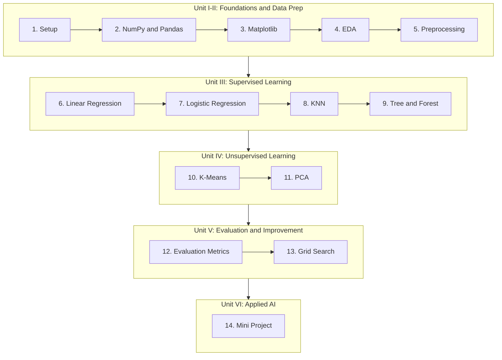

# 📊 CSE252 — Introduction to AI and Machine Learning: 14 Practicals

    

A complete, GitHub-ready lab manual for CSE252 (Introduction to Artificial Intelligence and Machine Learning), following Russell & Norvig's *Artificial Intelligence: A Modern Approach*. Every dataset is real — the actual Titanic passenger manifest and the real UCI Student Performance dataset. Every script has been run and its real output is shown in the matching README.

---

## 📑 Table of Contents

- [How This Repository Is Organized](#how-this-repository-is-organized)
- [The Course, as One Picture](#the-course-as-one-picture)
- [The 14 Practicals](#the-14-practicals)
- [What's Real, Not Made Up](#whats-real-not-made-up)
- [Two Ways to Run Every Practical](#two-ways-to-run-every-practical)
- [Putting This on Your Own GitHub](#putting-this-on-your-own-github)
- [Troubleshooting](#troubleshooting)
- [License](#license)

---

<a id="how-this-repository-is-organized"></a>
## How This Repository Is Organized

```
CSE252-AI-ML-Practicals/
├── README.md                      <- you are here
├── requirements.txt
├── LICENSE
├── .gitignore
├── datasets/                      <- shared real datasets + where they came from
│   ├── README.md
│   ├── titanic.csv
│   └── student-mat.csv
└── Practical-01 ... Practical-14/
    ├── README.md                  <- full guide: theory, math, code, Colab cells
    ├── <script>.py                <- the tested, runnable code
    └── images/                    <- real charts generated by running the code
```

Every practical's README follows the same shape:

1. What You'll Build
2. Visual Overview (Mermaid diagram)
3. Theory (formulas in GitHub-native LaTeX)
4. Tools — Why, What, How
5. The Dataset
6. Setup
7. Code Walkthrough (line by line, with real tested output)
8. Full Code (VSCode-ready, single file)
9. Google Colab Version (same tested code, split into cells)
10. Try It Yourself
11. Common Mistakes
12. Quiz
13. Summary

---

<a id="the-course-as-one-picture"></a>
## The Course, as One Picture



The mini project (Practical 14) directly reuses the preprocessing, modeling, and evaluation patterns established across Practicals 5, 9, and 12 — a real, complete AI development lifecycle in one pipeline.

---

<a id="the-14-practicals"></a>
## The 14 Practicals

| # | Practical | Real Data | Guide |
|---|---|---|---|
| 1 | Setup: Python, Jupyter, Colab | — | [Open](Practical-01-Setup-Python-Jupyter-Colab/README.md) |
| 2 | NumPy and Pandas | Real Titanic (891 passengers) | [Open](Practical-02-NumPy-Pandas/README.md) |
| 3 | Matplotlib visualization | Real Titanic | [Open](Practical-03-Matplotlib-Visualization/README.md) |
| 4 | Exploratory Data Analysis | Real Titanic + real Student Performance | [Open](Practical-04-Exploratory-Data-Analysis/README.md) |
| 5 | Data preprocessing | Real Titanic | [Open](Practical-05-Data-Preprocessing/README.md) |
| 6 | Linear Regression | Real Student Performance (395 students) | [Open](Practical-06-Linear-Regression/README.md) |
| 7 | Logistic Regression | Real Titanic | [Open](Practical-07-Logistic-Regression/README.md) |
| 8 | K-Nearest Neighbour | Real Titanic | [Open](Practical-08-KNN-Classification/README.md) |
| 9 | Decision Tree and Random Forest | Real Titanic | [Open](Practical-09-DecisionTree-RandomForest/README.md) |
| 10 | K-Means Clustering | Real Student Performance | [Open](Practical-10-KMeans-Clustering/README.md) |
| 11 | PCA Dimensionality Reduction | Real Titanic | [Open](Practical-11-PCA/README.md) |
| 12 | Model Evaluation Metrics | Real Titanic | [Open](Practical-12-Model-Evaluation-Metrics/README.md) |
| 13 | Hyperparameter Tuning (Grid Search) | Real Titanic | [Open](Practical-13-GridSearch-Tuning/README.md) |
| 14 | Mini Project: Smart Early-Warning System | Real Student Performance | [Open](Practical-14-Mini-Project/README.md) |

---

<a id="whats-real-not-made-up"></a>
## What's Real, Not Made Up

| Data | Real source |
|---|---|
| Titanic passenger records | Real 1912 historical manifest, public GitHub mirror |
| Student Performance data | Real UCI dataset (Cortez & Silva, 2008), 395 real Portuguese students |

Real, honestly reported findings you'll see throughout: a 63% vs 24% survival gap by class, a 17-point KNN accuracy swing from scaling, a case where Grid Search's "best" model scored worse on the test set than the defaults, and a real false positive in the final mini project. See [`datasets/README.md`](datasets/README.md) for full sourcing details.

---

<a id="two-ways-to-run-every-practical"></a>
## Two Ways to Run Every Practical

### Option A — Local Python script

```bash
git clone https://github.com/<your-username>/CSE252-AI-ML-Practicals.git
cd CSE252-AI-ML-Practicals
pip install -r requirements.txt
cd Practical-02-NumPy-Pandas
python numpy_pandas_demo.py
```

### Option B — Google Colab

Every practical's README has a **"Google Colab Version"** section with the same tested code, already split into ready-to-paste cells. Open [colab.research.google.com](https://colab.research.google.com), create a new notebook, and paste in order. The first cell clones this repo directly inside Colab:

```python
!git clone https://github.com/<your-username>/CSE252-AI-ML-Practicals.git
%cd CSE252-AI-ML-Practicals/Practical-02-NumPy-Pandas
```

---

<a id="putting-this-on-your-own-github"></a>
## Putting This on Your Own GitHub

```bash
git init
git add .
git commit -m "CSE252 practicals: 14 complete guides, real data throughout"
git branch -M main
git remote add origin https://github.com/<your-username>/CSE252-AI-ML-Practicals.git
git push -u origin main
```

Every Mermaid diagram and every math formula (using GitHub's native `$$...$$` math support) renders automatically once pushed — no extra setup needed.

---

<a id="troubleshooting"></a>
## Troubleshooting

| Problem | Fix |
|---|---|
| `ModuleNotFoundError` | `pip install -r requirements.txt` |
| Can't find `titanic.csv` or `student-mat.csv` | `cd` into the practical's own folder first — every script uses `../datasets/<file>.csv` |
| Charts don't pop up | Expected — every script saves charts into `images/` instead of opening a window |
| Mermaid diagram shows as plain text | Only happens on raw file view or older Markdown viewers — renders correctly on GitHub itself |
| Math formulas show as plain text with `$$` symbols | Only happens on very old Markdown viewers — GitHub renders these natively |

---

<a id="license"></a>
## License

MIT — free to use, adapt, and share for learning.
